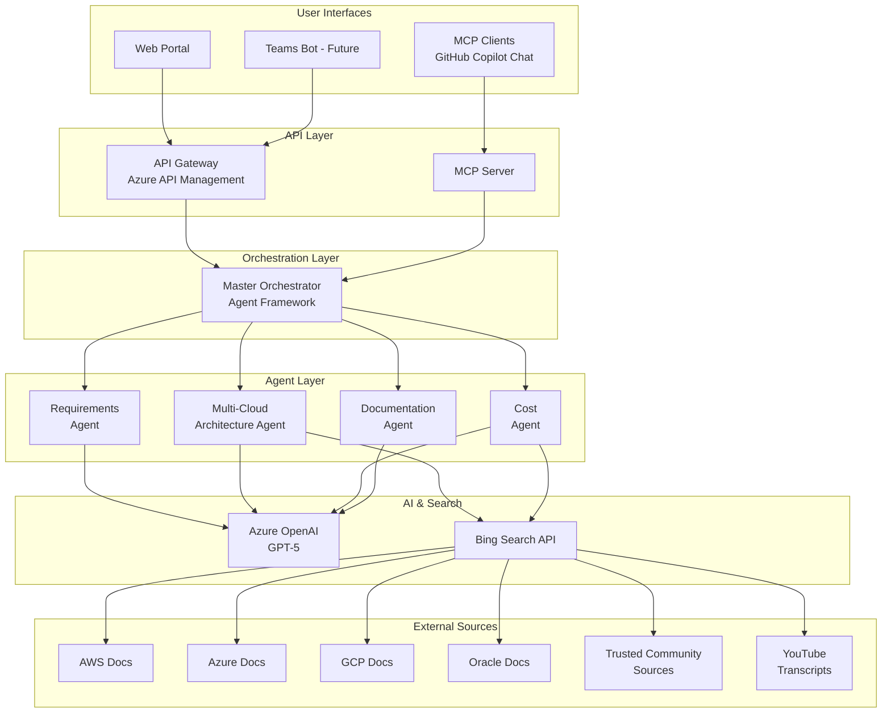
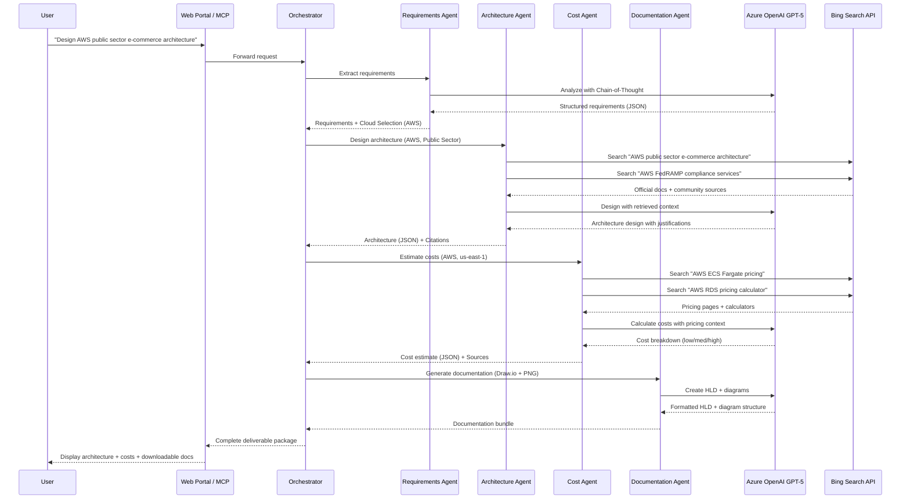
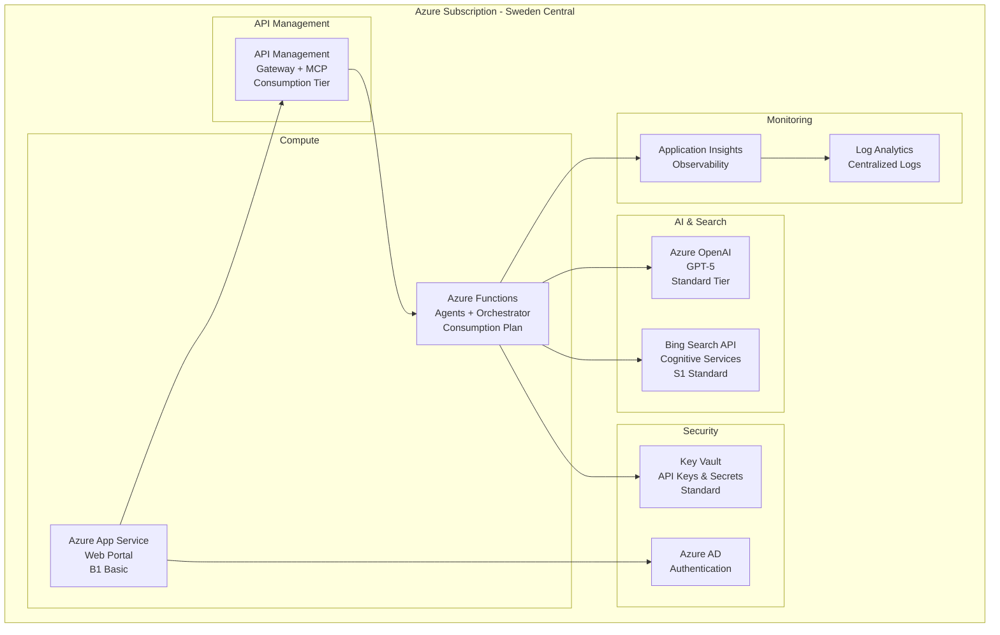
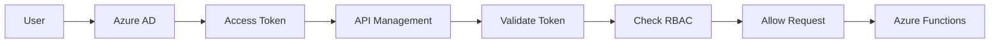
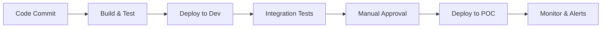

# System Architecture

**Project:** Co-Pilot for Solution Engineers  
**Version:** 2.0 (Multi-Cloud POC)  
**Date:** October 31, 2025

---

## Table of Contents

1. [High-Level Architecture](#high-level-architecture)
2. [Core Components](#core-components)
3. [Data Flow](#data-flow)
4. [Multi-Cloud Support](#multi-cloud-support)
5. [Infrastructure Design](#infrastructure-design)
6. [Security Architecture](#security-architecture)
7. [Integration Architecture](#integration-architecture)
8. [Scalability Considerations](#scalability-considerations)

---

## High-Level Architecture

### System Overview



### Key Architectural Principles

1. **Simplicity**: Minimal infrastructure, online-only data retrieval
2. **Multi-Cloud**: Support AWS, GCP, Azure, Oracle with unified agent
3. **Stateless**: No persistent storage of customer data (POC phase)
4. **Extensible**: MCP integration for external tools
5. **Observable**: Comprehensive logging and monitoring

---

## Core Components

### Component Summary

| Component | Purpose | Technology | Count |
|-----------|---------|------------|-------|
| Master Orchestrator | Workflow coordination | Microsoft Agent Framework | 1 |
| Requirements Agent | Extract requirements | Azure OpenAI GPT-5 | 1 |
| Architecture Agent | Design multi-cloud solutions | Azure OpenAI GPT-5 | 1 |
| Cost Agent | Estimate costs | Azure OpenAI GPT-5 | 1 |
| Documentation Agent | Generate deliverables | Azure OpenAI GPT-5 | 1 |
| Bing Search | Real-time search | Bing Search API | 1 |
| MCP Server | External integrations | MCP Protocol | 1 |

### Removed Components (vs. Original)

**No longer in architecture:**
- ❌ Compliance Validation Agent
- ❌ Knowledge Ingestion Pipeline
- ❌ Retrieval Engine (RAG)
- ❌ Citation Tracker (simplified)
- ❌ Azure AI Search
- ❌ Vector Database
- ❌ SQL Database
- ❌ Blob Storage
- ❌ Redis Cache

---

## Core Components Details

### 1. Master Orchestrator

**Purpose**: Coordinates agent workflow, manages conversation state, routes requests

**Responsibilities:**
- Parse incoming requests (UI or MCP)
- Determine which agents to invoke
- Manage workflow state across agent calls
- Aggregate agent responses
- Return formatted results to user

**Technology:**
- Microsoft Agent Framework
- Azure Functions or App Service

**Key Orchestration Logic:**
```python
class MasterOrchestrator:
    def process_request(self, user_input, context):
        # Stage 1: Extract requirements
        requirements = self.requirements_agent.extract(user_input)
        
        if requirements.needs_clarification:
            return self.ask_clarifying_questions(requirements.ambiguities)
        
        # Stage 2: Design architecture for selected cloud
        architecture = self.architecture_agent.design(
            requirements=requirements,
            target_cloud=requirements.cloud_platform,
            industry=requirements.industry_vertical
        )
        
        # Stage 3: Estimate costs
        costs = self.cost_agent.estimate(
            architecture=architecture,
            cloud=requirements.cloud_platform,
            region=requirements.region
        )
        
        # Stage 4: Generate documentation
        documentation = self.documentation_agent.generate(
            architecture=architecture,
            costs=costs,
            format=context.output_format
        )
        
        return {
            "requirements": requirements,
            "architecture": architecture,
            "costs": costs,
            "documentation": documentation,
            "citations": self.aggregate_citations()
        }
```

---

### 2. Requirements Extraction Agent

**Purpose**: Parse conversational input, extract technical requirements, identify cloud selection

**Chain-of-Thought Stages:**
1. **Understand**: Parse natural language input
2. **Research**: Identify technical patterns and requirements
3. **Extract**: Structure requirements into JSON format
4. **Validate**: Check for ambiguities
5. **Clarify**: Ask questions if needed

**Inputs:**
- User conversation (text)
- Context from previous messages (if any)

**Outputs:**
```json
{
  "target_cloud": "aws",
  "region": "us-east-1",
  "industry_vertical": "public_sector",
  "requirements": {
    "functional": [
      "Web application with user authentication",
      "File storage and processing",
      "Real-time notifications"
    ],
    "non_functional": {
      "performance": "Support 10,000 concurrent users",
      "availability": "99.9% uptime SLA",
      "security": "Data encryption at rest and in transit",
      "compliance": "FedRAMP compliance required"
    }
  },
  "constraints": {
    "budget": "$10,000/month",
    "timeline": "3 months to production",
    "team_skills": ["Python", "JavaScript", "DevOps"]
  },
  "ambiguities": [
    "Database size/growth not specified - need clarification",
    "Geographic distribution unclear - single region or multi-region?"
  ],
  "needs_clarification": true
}
```

---

### 3. Multi-Cloud Architecture Design Agent

**Purpose**: Design cloud architecture for AWS, GCP, Azure, or Oracle

**Cloud Selection Strategy:**
- User specifies target cloud at conversation start
- Agent loads cloud-specific context and patterns
- Searches for cloud-specific documentation
- Applies cloud-native best practices

**Chain-of-Thought Stages:**
1. **Understand**: Review requirements and cloud selection
2. **Research**: Search for cloud-specific solutions via Bing
3. **Design**: Map requirements to cloud services
4. **Validate**: Check against best practices
5. **Document**: Justify design with citations

**Search Strategy:**
```python
def search_for_solutions(self, requirements, cloud):
    queries = [
        f"{cloud} architecture for {requirements.use_case}",
        f"{cloud} {requirements.primary_workload} best practices",
        f"{cloud} {requirements.compliance} compliance architecture",
        f"{cloud} well-architected framework"
    ]
    
    results = []
    for query in queries:
        # Search official docs + community sources
        search_results = bing_search(query, site_filters=[
            f"site:{self.official_docs[cloud]}",
            f"{self.community_sources[cloud]}"
        ])
        results.extend(search_results)
    
    return self.synthesize_architecture(results, requirements)
```

**Example Output:**
```json
{
  "cloud": "aws",
  "architecture": {
    "overview": "Three-tier serverless architecture with managed services",
    "components": [
      {
        "name": "Web Tier",
        "services": ["Amazon ECS (Fargate)", "Application Load Balancer"],
        "justification": "Serverless containers eliminate infrastructure management. ALB provides HA across AZs.",
        "alternatives_considered": [
          "EC2 Auto Scaling - More control but higher operational overhead",
          "EKS - Overkill for this workload, more expensive"
        ],
        "citations": [
          "https://docs.aws.amazon.com/ecs/ - ECS Fargate documentation",
          "AWS Well-Architected Framework - Performance Efficiency Pillar"
        ]
      },
      {
        "name": "Authentication",
        "services": ["Amazon Cognito"],
        "justification": "Managed user directory with MFA support, integrates natively with ALB",
        "alternatives_considered": [
          "Custom auth on Lambda - More flexible but higher development cost",
          "Third-party IDaaS (Okta) - Additional cost and external dependency"
        ],
        "citations": ["https://docs.aws.amazon.com/cognito/"]
      }
    ],
    "best_practices_applied": [
      "Multi-AZ deployment for high availability (99.99% SLA)",
      "Auto-scaling for performance under load",
      "Encryption at rest (S3/EBS with KMS) and in transit (TLS 1.2+)",
      "Least privilege IAM policies",
      "FedRAMP compliant services selected"
    ],
    "architecture_diagram_description": "ALB → ECS Fargate tasks → RDS Aurora (Multi-AZ) + S3 for storage. Cognito for authentication. CloudWatch for monitoring."
  }
}
```

---

### 4. Cost Estimation Agent

**Purpose**: Estimate costs using public pricing sources

**Data Sources:**
- Bing Search for pricing pages
- Public pricing calculators (no authentication)
- Curated pricing guides (updated quarterly)

**Chain-of-Thought Stages:**
1. **Understand**: Extract services from architecture
2. **Research**: Search for pricing information
3. **Calculate**: Compute costs per service
4. **Aggregate**: Summarize by category
5. **Document**: Provide assumptions and disclaimers

**Example Search Queries:**
```python
pricing_queries = [
    f"{cloud} {service_name} pricing",
    f"{cloud} pricing calculator",
    f"{service_name} cost {region}",
    f"{cloud} {service_name} pricing comparison"
]
```

**Example Output:**
```json
{
  "summary": {
    "monthly_low": 6500,
    "monthly_estimated": 9200,
    "monthly_high": 13500,
    "currency": "USD",
    "region": "us-east-1",
    "confidence": "Medium"
  },
  "breakdown": {
    "compute": {
      "description": "ECS Fargate tasks (3 tasks, 2 vCPU, 4GB each)",
      "monthly_cost": 4200,
      "calculation": "3 tasks × 730 hours × $0.04048/vCPU-hour × 2 vCPUs = $3,600 + 3 × 730 × $0.004445/GB-hour × 4GB = $600"
    },
    "storage": {
      "description": "S3 Standard (1TB) + EBS snapshots (500GB)",
      "monthly_cost": 800,
      "calculation": "S3: 1TB × $23/TB = $23 + 1TB × $0.09/GB first 50TB data retrieval ≈ $600. EBS snapshots: 500GB × $0.05/GB = $200"
    },
    "networking": {
      "description": "Application Load Balancer + data transfer out",
      "monthly_cost": 400
    },
    "database": {
      "description": "RDS Aurora PostgreSQL (db.r5.large Multi-AZ)",
      "monthly_cost": 2800
    },
    "other": {
      "description": "Cognito, CloudWatch, backups",
      "monthly_cost": 1000
    }
  },
  "assumptions": [
    "Based on public AWS pricing as of October 31, 2025",
    "Standard tier services (no reserved instances or savings plans)",
    "Medium usage scenario: 10,000 concurrent users, ~1M requests/day",
    "US East (N. Virginia) region",
    "24x7 uptime with Multi-AZ for RDS and ALB",
    "1TB data storage, 2TB monthly data transfer out",
    "No AWS Support plan included"
  ],
  "disclaimer": "This is a preliminary estimate based on publicly available pricing information. Actual costs may vary significantly based on usage patterns, discounts, reserved capacity, and other factors. Consult AWS for accurate pricing tailored to your specific requirements.",
  "sources": [
    "https://aws.amazon.com/pricing/ - AWS Official Pricing",
    "https://calculator.aws/ - AWS Pricing Calculator",
    "AWS ECS Fargate pricing page (accessed 2025-10-31)",
    "AWS RDS Aurora pricing page (accessed 2025-10-31)"
  ]
}
```

---

### 5. Documentation Generation Agent

**Purpose**: Generate HLD document, diagrams, and presentations

**Chain-of-Thought Stages:**
1. **Understand**: Review architecture and cost data
2. **Structure**: Organize HLD document outline
3. **Generate**: Create detailed sections
4. **Diagram**: Generate architecture diagrams
5. **Format**: Export in requested formats

**Generated Deliverables:**

**1. High-Level Design (HLD) Document:**
- Executive Summary
- Requirements Overview
- Architecture Design
  - Component descriptions
  - Service justifications
  - Best practices applied
- Cost Breakdown
- Implementation Considerations
- Citations and References

**2. Architecture Diagrams:**
- **Draw.io XML** (primary): Editable format
- **PNG Image**: For sharing/embedding
- **PowerPoint**: For presentations

**3. Cost Summary Tables:**
- Breakdown by category
- Low/Medium/High scenarios
- Assumptions documented

**Diagram Generation:**
```python
def generate_diagram(self, architecture, cloud):
    # Load cloud-specific icon set
    icons = self.load_cloud_icons(cloud)
    
    # Create diagram structure
    diagram = DrawIODiagram()
    
    # Add components
    for component in architecture.components:
        diagram.add_node(
            component.name,
            icon=icons[component.primary_service],
            description=component.description
        )
    
    # Add connections
    for connection in architecture.connections:
        diagram.add_edge(
            connection.from_component,
            connection.to_component,
            label=connection.protocol
        )
    
    # Export formats
    return {
        "drawio_xml": diagram.export_drawio(),
        "png": diagram.export_png(resolution=300),
        "pptx": diagram.export_powerpoint()
    }
```

---

### 6. Bing Search Integration

**Purpose**: Real-time search for cloud documentation, best practices, pricing

**Search Categories:**

**1. Official Documentation:**
```python
official_docs = {
    "aws": ["docs.aws.amazon.com", "aws.amazon.com/blogs", "aws.amazon.com/architecture"],
    "azure": ["learn.microsoft.com", "azure.microsoft.com", "docs.microsoft.com/azure"],
    "gcp": ["cloud.google.com/docs", "cloud.google.com/blog", "cloud.google.com/architecture"],
    "oracle": ["docs.oracle.com/cloud", "blogs.oracle.com/cloud"]
}
```

**2. Trusted Community Sources:**
```python
community_sources = {
    "azure": ["John Savill", "Azure Friday", "Thomas Maurer"],
    "aws": ["Werner Vogels", "AWS re:Invent", "AWS Architecture Blog"],
    "gcp": ["Google Cloud Blog", "Cloud Next"],
    "oracle": ["Oracle Cloud Infrastructure Blog"]
}
```

**3. Pricing Information:**
```python
def search_pricing(cloud, service, region):
    queries = [
        f"{cloud} {service} pricing calculator",
        f"{cloud} {service} cost {region}",
        f"{service} pricing {cloud} {region} 2025"
    ]
    return bing_search(queries, count=5)
```

**4. YouTube Transcripts:**
```python
def get_youtube_transcript(video_url):
    # Extract video ID
    video_id = extract_video_id(video_url)
    
    # Use YouTube Data API to fetch transcript
    transcript = youtube_api.get_transcript(video_id)
    
    return transcript
```

**Query Optimization:**
- Use site filters for targeted results
- Combine multiple queries for comprehensive coverage
- Re-rank results based on recency and authority
- Cache frequently accessed results (session-based)

---

### 7. MCP Server

**Purpose**: Expose Co-Pilot functionality via Model Context Protocol

**MCP Tools Exposed:**

```json
{
  "tools": [
    {
      "name": "design_cloud_architecture",
      "description": "Design cloud architecture for AWS, GCP, Azure, or Oracle Cloud based on natural language requirements",
      "inputSchema": {
        "type": "object",
        "properties": {
          "requirements": {"type": "string", "description": "Natural language description of requirements"},
          "cloud_provider": {"type": "string", "enum": ["aws", "gcp", "azure", "oracle"]},
          "industry_vertical": {"type": "string", "description": "e.g., public_sector, healthcare, finance"},
          "region": {"type": "string", "description": "Preferred cloud region"},
          "output_format": {"type": "string", "enum": ["json", "markdown"], "default": "markdown"}
        },
        "required": ["requirements", "cloud_provider"]
      }
    },
    {
      "name": "estimate_cloud_costs",
      "description": "Estimate costs for proposed architecture using public pricing sources",
      "inputSchema": {
        "type": "object",
        "properties": {
          "architecture": {"type": "string", "description": "Architecture design (JSON or text)"},
          "cloud_provider": {"type": "string", "enum": ["aws", "gcp", "azure", "oracle"]},
          "region": {"type": "string"},
          "usage_scenario": {"type": "string", "enum": ["low", "medium", "high"], "default": "medium"}
        },
        "required": ["architecture", "cloud_provider", "region"]
      }
    },
    {
      "name": "generate_architecture_documentation",
      "description": "Generate HLD document and architecture diagrams",
      "inputSchema": {
        "type": "object",
        "properties": {
          "architecture": {"type": "string"},
          "cost_estimate": {"type": "string", "description": "Optional cost estimate"},
          "diagram_format": {"type": "string", "enum": ["drawio", "png", "pptx"], "default": "drawio"}
        },
        "required": ["architecture"]
      }
    }
  ]
}
```

**Authentication:**
- Azure AD OAuth 2.0
- Token-based authentication
- Scope-based permissions

**Integration Example (GitHub Copilot Chat):**
```
User: @copilot-se design an AWS architecture for an e-commerce platform

GitHub Copilot Chat → MCP Client → MCP Server → Co-Pilot Orchestrator
→ Requirements Agent + Architecture Agent + Cost Agent + Documentation Agent
→ Response returned to GitHub Copilot Chat
```

---

## Data Flow

### End-to-End Workflow



### Session State Management

**POC Phase (Stateless):**
- No database or persistent storage
- Session state maintained in memory during active conversation
- Results returned to user immediately
- No conversation history stored

**Future Enhancement (Post-POC):**
- Add Azure SQL or Cosmos DB for conversation history
- Enable "resume from previous architecture"
- Store user preferences
- Track usage analytics

---

## Multi-Cloud Support

### Unified Agent Strategy

**How One Agent Handles Multiple Clouds:**

1. **Cloud Detection**: User specifies target cloud ("Design an AWS architecture...")
2. **Context Loading**: Agent loads cloud-specific patterns and terminology
3. **Targeted Search**: Bing Search filtered to cloud-specific documentation
4. **Native Design**: Uses cloud-native services and best practices
5. **Cloud-Aware Output**: Diagrams use correct cloud icons and terminology

### Cloud-Specific Context

**Per-Cloud Configuration:**

```python
cloud_config = {
    "aws": {
        "official_docs": "docs.aws.amazon.com",
        "well_architected": "AWS Well-Architected Framework",
        "pricing": "https://calculator.aws/",
        "icon_set": "aws_icons_2024",
        "compute_services": ["EC2", "ECS", "EKS", "Lambda", "Fargate"],
        "storage_services": ["S3", "EBS", "EFS"],
        "database_services": ["RDS", "Aurora", "DynamoDB", "Redshift"]
    },
    "azure": {
        "official_docs": "learn.microsoft.com",
        "well_architected": "Azure Well-Architected Framework",
        "pricing": "https://azure.microsoft.com/pricing/calculator/",
        "icon_set": "azure_icons_2024",
        "compute_services": ["VMs", "App Service", "AKS", "Functions", "Container Instances"],
        "storage_services": ["Blob Storage", "Managed Disks", "Files"],
        "database_services": ["SQL Database", "Cosmos DB", "PostgreSQL", "MySQL"]
    },
    "gcp": {
        "official_docs": "cloud.google.com/docs",
        "well_architected": "GCP Architecture Framework",
        "pricing": "https://cloud.google.com/products/calculator",
        "icon_set": "gcp_icons_2024",
        "compute_services": ["Compute Engine", "GKE", "Cloud Run", "Cloud Functions"],
        "storage_services": ["Cloud Storage", "Persistent Disk", "Filestore"],
        "database_services": ["Cloud SQL", "Cloud Spanner", "Firestore", "BigQuery"]
    },
    "oracle": {
        "official_docs": "docs.oracle.com/cloud",
        "well_architected": "Oracle Cloud Architecture Center",
        "pricing": "https://www.oracle.com/cloud/cost-estimator.html",
        "icon_set": "oci_icons_2024",
        "compute_services": ["Compute Instances", "Container Engine", "Functions"],
        "storage_services": ["Object Storage", "Block Volumes", "File Storage"],
        "database_services": ["Autonomous Database", "Exadata", "MySQL", "NoSQL"]
    }
}
```

---

## Infrastructure Design

### Azure Resources (POC)



### Infrastructure Cost Estimate (POC)

| Component | SKU | Monthly Cost (USD) |
|-----------|-----|-------------------|
| Azure App Service | B1 Basic | $55 |
| Azure Functions | Consumption | $50 |
| Azure OpenAI GPT-5 | Standard (100K tokens/day) | $500 |
| Bing Search API | S1 (10K queries/month) | $100 |
| API Management | Consumption | $50 |
| Key Vault | Standard | $5 |
| Application Insights | Pay-as-you-go | $50 |
| **Total** | | **~$810/month** |

**Assumptions:**
- 10 concurrent users
- ~50 architecture generations/day
- ~10K Bing Search queries/month
- ~100K GPT-5 tokens/day
- Low traffic (POC scale)

---

## Security Architecture

### Authentication & Authorization



**Azure AD Integration:**
- Single Sign-On (SSO)
- Multi-Factor Authentication (MFA) supported
- Role-Based Access Control (RBAC)

**RBAC Roles:**
- **Architect**: Full access (design, estimate, generate)
- **Viewer**: Read-only (view shared architectures - future)
- **Admin**: Manage users, view usage metrics

### Data Security

**In Transit:**
- TLS 1.2+ for all communications
- HTTPS only (HTTP redirected)
- Certificate management via Azure

**At Rest:**
- No persistent customer data stored (POC)
- API keys stored in Azure Key Vault (encrypted)
- Logs encrypted in Log Analytics

**Session Security:**
- Session tokens expire after inactivity
- No PII logged in Application Insights
- Conversation data not persisted

### API Security

**API Management Policies:**
- Rate limiting: 100 requests/minute per user
- JWT validation (Azure AD tokens)
- IP whitelisting (optional)
- Request/response logging (excluding sensitive data)

**MCP Security:**
- OAuth 2.0 authentication
- Scope-based permissions
- Audit logging for all MCP calls

---

## Integration Architecture

### External Integrations

**1. Bing Search API:**
- **Purpose**: Real-time web search
- **Authentication**: Subscription key (stored in Key Vault)
- **Rate Limits**: 1000 queries/second (S1 tier)
- **Retry Strategy**: Exponential backoff (3 retries)
- **Circuit Breaker**: Fail open after 5 consecutive errors

**2. YouTube Data API:**
- **Purpose**: Extract video transcripts for community content
- **Authentication**: API key
- **Quota**: 10,000 units/day
- **Usage**: Fetch transcripts for videos from trusted sources

**3. Cloud Documentation (Public):**
- **AWS**: docs.aws.amazon.com (no auth)
- **Azure**: learn.microsoft.com (no auth)
- **GCP**: cloud.google.com/docs (no auth)
- **Oracle**: docs.oracle.com/cloud (no auth)
- **Access**: Via Bing Search or direct HTTP requests

### MCP Integration

**GitHub Copilot Chat Example:**

```typescript
// User in GitHub Copilot Chat
User: @copilot-se design an AWS serverless API

// GitHub Copilot Chat sends request to MCP Server
MCPRequest: {
  tool: "design_cloud_architecture",
  arguments: {
    requirements: "Serverless REST API with authentication and database",
    cloud_provider: "aws",
    industry_vertical: "general"
  }
}

// MCP Server invokes Co-Pilot Orchestrator
// Orchestrator runs agents and returns result

MCPResponse: {
  architecture: "API Gateway + Lambda + DynamoDB architecture...",
  cost_estimate: "$200-500/month based on 1M requests/month",
  diagram_url: "https://copilot-se.azurewebsites.net/diagrams/abc123.png",
  hld_url: "https://copilot-se.azurewebsites.net/docs/abc123.md"
}

// GitHub Copilot Chat displays result to user
```

---

## Scalability Considerations

### POC Scale (10 Users)

**Expected Load:**
- 10 concurrent users (max)
- ~50 architecture requests/day
- ~500 Bing Search queries/day
- ~100K GPT-5 tokens/day

**Infrastructure Scaling:**
- Azure Functions: Auto-scale (consumption plan)
- App Service: B1 sufficient for 10 users
- Azure OpenAI: Standard tier adequate
- Bing Search: S1 tier (1000 queries/sec)

**Performance Targets:**
- Requirements extraction: <5 seconds
- Architecture design: <30 seconds
- Cost estimation: <15 seconds
- Documentation generation: <20 seconds
- **Total end-to-end**: <90 seconds

### Future Scale (1000+ Users)

**When scaling to 1000+ architects:**

**Infrastructure Changes:**
- Upgrade App Service to P-series (Premium)
- Azure Functions Premium Plan (dedicated instances)
- Increase Azure OpenAI quotas
- Add Azure Front Door (CDN + global load balancing)
- Implement Redis Cache for session state
- Multi-region deployment

**Architecture Enhancements:**
- Add persistent storage (Cosmos DB or SQL)
- Implement conversation history
- Add document upload and RAG capabilities
- Deploy to multiple regions (US, Europe, Asia)
- Implement advanced caching strategies

**Cost Projection (1000 users):**
- Compute: $5,000/month
- Azure OpenAI: $15,000/month
- Bing Search: $1,500/month
- Storage & Database: $2,000/month
- Networking & CDN: $1,000/month
- **Total**: ~$24,500/month

---

## Monitoring & Observability

### Application Insights Metrics

**Standard Metrics:**
- Request count and latency
- Dependency calls (OpenAI, Bing Search)
- Exception count and types
- Availability (uptime)

**Custom Metrics:**
- Architecture generation count (by cloud)
- Agent invocation count (by type)
- GPT-5 token usage (by agent)
- Bing Search query count
- Cost estimation count
- Documentation export count (by format)

### Dashboards

**Real-Time Dashboard:**
- Active users
- Requests per minute
- Average response time
- Error rate
- Token usage rate

**Usage Analytics Dashboard:**
- Architecture count by cloud (AWS/GCP/Azure/Oracle)
- Most common use cases
- Average time per workflow stage
- User satisfaction (if feedback collected)

### Alerts

**Critical Alerts:**
- Error rate > 5% (5-minute window)
- Azure OpenAI throttling detected
- Bing Search quota exceeded
- Response time > 120 seconds (p95)
- API Management availability < 99%

**Warning Alerts:**
- Token usage approaching daily limit
- Search query cost spike
- High latency (>60s p95)

---

## Technology Stack Summary

| Layer | Component | Technology | Purpose |
|-------|-----------|-----------|---------|
| **Frontend** | Web Portal | React + TypeScript | User interface |
| | Teams Bot | Bot Framework | Conversational UI (future) |
| **API** | Gateway | Azure API Management | API routing, rate limiting |
| | MCP Server | Node.js + MCP SDK | External integrations |
| **Orchestration** | Agent Framework | Microsoft Agent Framework | Multi-agent coordination |
| **Agents** | Specialized Agents | Python + Azure Functions | Requirements, Architecture, Cost, Documentation |
| **AI** | LLM | Azure OpenAI GPT-5 | Reasoning and generation |
| | Search | Bing Search API | Real-time web search |
| **Security** | Authentication | Azure AD | SSO, MFA, RBAC |
| | Secrets | Azure Key Vault | API keys and secrets |
| **Monitoring** | Observability | Application Insights | Metrics, logs, traces |
| | Logs | Log Analytics | Centralized logging |
| **DevOps** | IaC | Bicep / Terraform | Infrastructure provisioning |
| | CI/CD | GitHub Actions | Automated deployment |

---

## Deployment Considerations

### Deployment Regions

**POC:**
- **Primary**: Sweden Central (Azure OpenAI available)
- **Backup**: None (single region)

**Future Multi-Region:**
- Sweden Central (Europe)
- East US 2 (North America)
- Southeast Asia (Asia Pacific)

### CI/CD Pipeline



**Pipeline Steps:**
1. Code commit to GitHub
2. GitHub Actions triggered
3. Build: Compile, lint, unit tests
4. Deploy to Dev environment
5. Integration tests
6. Manual approval gate
7. Deploy to POC environment
8. Smoke tests
9. Monitor and alert

---

**Last Updated:** October 31, 2025  
**Document Owner:** Solution Engineering Team  
**Version:** 2.0 (Multi-Cloud POC)
