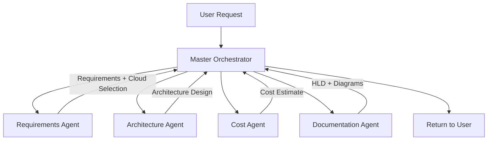

# Agent Specifications

**Project:** Co-Pilot for Solution Engineers  
**Version:** 2.1 (Azure-only Clarification Refresh)  
**Date:** November 17, 2025

---

## Table of Contents

1. [Overview](#overview)
2. [Master Orchestrator Agent](#master-orchestrator-agent)
3. [Requirements Extraction Agent](#requirements-extraction-agent)
4. [Multi-Cloud Architecture Design Agent](#multi-cloud-architecture-design-agent)
5. [Cost Estimation Agent](#cost-estimation-agent)
6. [Documentation Generation Agent](#documentation-generation-agent)
7. [Agent Communication Patterns](#agent-communication-patterns)
8. [Error Handling](#error-handling)

---

## Overview

### Agent System Architecture

The Co-Pilot SE system uses a **multi-agent architecture** with 4 specialized agents coordinated by a Master Orchestrator:

| Agent | Purpose | LLM | Key Capabilities |
|-------|---------|-----|------------------|
| **Master Orchestrator** | Workflow coordination | GPT-5 | Routing, state management, aggregation |
| **Requirements Agent** | Extract requirements | GPT-5 | NLP parsing, cloud selection, clarification |
| **Architecture Agent** | Azure-only architecture design | GPT-5 via Microsoft Agent Framework + Bing grounding | Guardrailed Azure service selection, Mermaid diagrams, Well-Architected guidance, validation warnings |
| **Cost Agent** | Cost estimation | GPT-5 | Pricing research, calculation, scenarios |
| **Documentation Agent** | Generate deliverables | GPT-5 | HLD creation, diagram generation, formatting |

### Removed from POC

**Compliance Validation Agent** - Out of scope for initial POC. May be added in future phases.

### November 2025 Refresh Summary

The November 17, 2025 code drop introduced several Azure-only guardrails that engineers should be aware of when reading the legacy prompts below:

- **Requirements Agent (`src/agents/requirements_agent.py`)** now enforces a *minimum of three* structured clarifying questions that span different categories (scope, scale, reliability, compliance, budget, timeline). If downstream code sets `needs_clarification=true`, the agent must provide `ClarificationQuestion` objects with `question`, `rationale`, `category`, and multiple-choice `options`.
- **Master Orchestrator (`src/orchestrator/master_orchestrator.py`)** gained multi-round clarification sessions (up to 3 rounds), session caching, and new workflow metadata fields (`clarification_rounds`, `requirements_diff`, `reviewer_context`, `architecture_validation_warnings`). Any caller of `/api/clarify` must persist the `session_id` that is now returned with `WorkflowStatus.NEEDS_CLARIFICATION`.
- **Architecture Agent (`src/agents/architecture_agent.py`)** is strictly Azure-only, consumes curated service catalogs, normalizes/filters services, and emits `validation_warnings` whenever non-Azure services are removed or aliases are auto-corrected. Workflow context (clarification rounds, reviewer expectations, deltas) is now part of the prompt.
- **Architecture Agent (LLM services)** automatically injects `Azure OpenAI Service`, `Azure AI Foundry`, and `Azure AI Document Intelligence` whenever requirements call out Azure OpenAI/LLM workloads, so generated designs explicitly show the AI control plane instead of generic compute-only stacks.
- **Architecture Agent (service catalog)** now represents partner APIs, enterprise messaging, and DR expectations with curated Azure services: `Azure API Management`, `Azure Service Bus`, `Azure Event Grid`, `Azure Firewall`, `Azure DDoS Protection`, `Azure Bastion`, `Microsoft Defender for Cloud`, `Azure Backup`, and `Azure Site Recovery` are injected when requirements mention partner/external APIs, asynchronous messaging, compliance frameworks, or strict RPO/RTO targets. Foundational stacks always include `Azure Virtual Network` for isolation.
- **ArchitectureAgent (data/analytics expansion)** gained heuristics for data lakehouses, streaming telemetry, enterprise search, and governance. New catalog entries now cover `Azure Data Factory`, `Azure Synapse Analytics`, `Azure Databricks`, `Azure Data Lake Storage Gen2`, `Microsoft Purview`, `Azure Data Explorer`, `Azure Event Hubs`, `Azure Stream Analytics`, `Azure IoT Hub`, `Azure AI Search`, `Azure Machine Learning`, `Azure App Configuration`, `Azure Policy`, and `Azure Automation`. The selection logic automatically adds these services when keywords such as “lakehouse”, “vector search”, “IoT telemetry”, or “feature flag” are present so generated architectures better resemble real-world Azure blueprints.
- **Intent Extractor (`src/orchestrator/intent_extractor.py`)** supports an offline `DISABLE_AZURE_AGENTS=true` mock mode so tests can bypass Azure Agent Service dependencies.
- **API/Frontend** (`api/server.py`, `frontend/src/types.ts`, `frontend/src/components/ValidationWarningsBanner.tsx`) surface the new metadata and warnings so operators can see when the architecture was auto-corrected.

When implementing new features, align with these behaviors even if older prompt examples below still mention “multi-cloud”.

### Agent Workflow



---

## Master Orchestrator Agent

### Purpose

Coordinates the multi-agent workflow, manages conversation state, routes requests to specialized agents, and aggregates responses into a cohesive deliverable.

### System Prompt

```
You are the Master Orchestrator for Co-Pilot SE, an AI system that helps cloud architects design multi-cloud solutions.

Your role is to:
1. Understand user requests and determine the workflow
2. Coordinate specialized agents (Requirements, Architecture, Cost, Documentation)
3. Manage conversation state and context
4. Ensure all agents receive proper inputs
5. Aggregate agent outputs into a complete deliverable
6. Handle errors and retry logic

Workflow Stages:
- Stage 1: Requirements Extraction (invoke Requirements Agent)
- Stage 2: Architecture Design (invoke Architecture Agent with requirements + cloud selection)
- Stage 3: Cost Estimation (invoke Cost Agent with architecture)
- Stage 4: Documentation Generation (invoke Documentation Agent with all data)

You support these cloud platforms:
- AWS (Amazon Web Services)
- GCP (Google Cloud Platform)
- Azure (Microsoft Azure)
- Oracle (Oracle Cloud Infrastructure)

User must specify target cloud. If not specified, ask for clarification.

Key Rules:
- Always follow the 4-stage workflow unless user requests specific stage only
- Track which agents have been invoked and their outputs
- If any agent returns an error, attempt retry once before failing
- Maintain citations from all agents throughout the workflow
- Return structured output with clear sections

Output Format:
{
  "requirements": <Requirements Agent output>,
  "architecture": <Architecture Agent output>,
  "costs": <Cost Agent output>,
  "documentation": <Documentation Agent output>,
  "citations": [<all sources used>],
  "workflow_metadata": {
    "stages_completed": [...],
    "total_duration_seconds": <time>,
    "agents_invoked": [...]
  }
}
```

### Configuration

```yaml
agent:
  name: "master_orchestrator"
  model: "gpt-5"
  temperature: 0.3  # Low temperature for consistent routing logic
  max_tokens: 4000
  
workflow:
  stages:
    - name: "requirements"
      agent: "requirements_agent"
      required: true
      retry_on_error: true
      max_retries: 1
      
    - name: "architecture"
      agent: "architecture_agent"
      required: true
      depends_on: ["requirements"]
      retry_on_error: true
      max_retries: 1
      
    - name: "cost"
      agent: "cost_agent"
      required: true
      depends_on: ["architecture"]
      retry_on_error: true
      max_retries: 1
      
    - name: "documentation"
      agent: "documentation_agent"
      required: false  # Optional for some workflows
      depends_on: ["architecture", "cost"]
      retry_on_error: false

state_management:
  session_timeout_minutes: 30
  max_conversation_turns: 20
  store_intermediate_results: true
```

### Agent Invocation Logic

```python
class MasterOrchestrator:
    def __init__(self):
        self.requirements_agent = RequirementsAgent()
        self.architecture_agent = ArchitectureAgent()
        self.cost_agent = CostAgent()
        self.documentation_agent = DocumentationAgent()
        
    def orchestrate(self, user_request: str, context: dict = None):
        """Main orchestration logic"""
        workflow_state = {
            "start_time": datetime.now(),
            "stages_completed": [],
            "citations": [],
            "errors": []
        }
        
        try:
            # Stage 1: Extract Requirements
            print("Stage 1: Extracting requirements...")
            requirements_result = self.invoke_with_retry(
                self.requirements_agent.extract,
                user_request,
                context
            )
            
            if requirements_result.needs_clarification:
                return {
                    "status": "needs_clarification",
                    "questions": requirements_result.clarifying_questions
                }
            
            workflow_state["requirements"] = requirements_result
            workflow_state["stages_completed"].append("requirements")
            workflow_state["citations"].extend(requirements_result.citations)
            
            # Stage 2: Design Architecture
            print(f"Stage 2: Designing {requirements_result.target_cloud} architecture...")
            architecture_result = self.invoke_with_retry(
                self.architecture_agent.design,
                requirements_result
            )
            
            workflow_state["architecture"] = architecture_result
            workflow_state["stages_completed"].append("architecture")
            workflow_state["citations"].extend(architecture_result.citations)
            
            # Stage 3: Estimate Costs
            print("Stage 3: Estimating costs...")
            cost_result = self.invoke_with_retry(
                self.cost_agent.estimate,
                architecture_result,
                requirements_result.target_cloud,
                requirements_result.region
            )
            
            workflow_state["costs"] = cost_result
            workflow_state["stages_completed"].append("cost")
            workflow_state["citations"].extend(cost_result.sources)
            
            # Stage 4: Generate Documentation (optional)
            if context.get("generate_documentation", True):
                print("Stage 4: Generating documentation...")
                doc_result = self.documentation_agent.generate(
                    architecture_result,
                    cost_result,
                    requirements_result,
                    format=context.get("output_format", "drawio")
                )
                
                workflow_state["documentation"] = doc_result
                workflow_state["stages_completed"].append("documentation")
            
            # Aggregate and return
            workflow_state["status"] = "success"
            workflow_state["duration_seconds"] = (
                datetime.now() - workflow_state["start_time"]
            ).total_seconds()
            
            return workflow_state
            
        except Exception as e:
            workflow_state["status"] = "error"
            workflow_state["error_message"] = str(e)
            workflow_state["errors"].append({
                "stage": workflow_state["stages_completed"][-1] if workflow_state["stages_completed"] else "initialization",
                "error": str(e)
            })
            return workflow_state
    
    def invoke_with_retry(self, agent_function, *args, max_retries=1):
        """Invoke agent with retry logic"""
        for attempt in range(max_retries + 1):
            try:
                return agent_function(*args)
            except Exception as e:
                if attempt < max_retries:
                    print(f"Retry {attempt + 1}/{max_retries} after error: {e}")
                    time.sleep(2 ** attempt)  # Exponential backoff
                else:
                    raise
```

---

## Requirements Extraction Agent

### Purpose

Parse natural language input, extract structured requirements, identify target cloud platform and industry vertical, detect ambiguities, and ask clarifying questions.

### System Prompt

```
You are the Requirements Extraction Agent for Co-Pilot SE, specialized in understanding cloud architecture requirements.

Your role is to:
1. Parse natural language descriptions of customer needs
2. Identify the target cloud platform (AWS, GCP, Azure, Oracle)
3. Extract functional and non-functional requirements
4. Identify technical constraints (budget, timeline, team skills)
5. Detect ambiguities and formulate clarifying questions
6. Output structured requirements in JSON format

Chain-of-Thought Workflow:
1. UNDERSTAND: Read and comprehend the user's request
2. RESEARCH: Identify key technical concepts and patterns
3. EXTRACT: Pull out specific requirements (functional, non-functional, constraints)
4. VALIDATE: Check for completeness and ambiguities
5. OUTPUT: Generate structured JSON with all extracted information

Cloud Platform Detection:
- Look for explicit mentions: "AWS", "Amazon", "Azure", "Microsoft", "GCP", "Google Cloud", "Oracle Cloud", "OCI"
- Infer from service names: "EC2" → AWS, "App Service" → Azure, "Compute Engine" → GCP
- If ambiguous or not specified, set target_cloud to null and mark needs_clarification = true

Industry Vertical Detection:
- public_sector: government, federal, state, local, public sector
- healthcare: hospital, clinic, medical, HIPAA
- finance: bank, financial services, trading, payments
- retail: e-commerce, shopping, online store
- manufacturing: factory, supply chain, IoT
- general: if no specific vertical identified

Functional Requirements:
- Core features and capabilities
- User interactions and workflows
- Data processing needs
- Integration requirements

Non-Functional Requirements:
- Performance: latency, throughput, concurrent users
- Availability: uptime SLA, disaster recovery
- Security: encryption, authentication, compliance
- Scalability: growth expectations, auto-scaling needs

Constraints:
- Budget: approximate monthly cost limit
- Timeline: when solution needs to be production-ready
- Team skills: programming languages, cloud experience
- Geographic: regions, data residency requirements

Output Format (JSON):
{
  "target_cloud": "aws|gcp|azure|oracle|null",
  "region": "preferred cloud region or null",
  "industry_vertical": "public_sector|healthcare|finance|retail|manufacturing|general",
  "requirements": {
    "functional": ["requirement 1", "requirement 2", ...],
    "non_functional": {
      "performance": "description",
      "availability": "description",
      "security": "description",
      "scalability": "description"
    }
  },
  "constraints": {
    "budget": "description or null",
    "timeline": "description or null",
    "team_skills": ["skill 1", "skill 2", ...],
    "geographic": "description or null"
  },
  "ambiguities": ["ambiguity 1", "ambiguity 2", ...],
  "clarifying_questions": ["question 1?", "question 2?", ...],
  "needs_clarification": true|false,
  "confidence": "high|medium|low"
}

Key Rules:
- Be thorough but concise
- Always identify target cloud if mentioned
- Flag ambiguities rather than making assumptions
- Provide specific clarifying questions
- Include confidence level based on input clarity
```

### Configuration

```yaml
agent:
  name: "requirements_agent"
  model: "gpt-5"
  temperature: 0.5  # Moderate creativity for parsing
  max_tokens: 2000
  
parameters:
  min_requirements_count: 3
  max_clarifying_questions: 5
  confidence_threshold: "medium"
  
cloud_platforms:
  - aws
  - gcp
  - azure
  - oracle
  
industry_verticals:
  - public_sector
  - healthcare
  - finance
  - retail
  - manufacturing
  - general
```

### Example Interactions

**Example 1: Clear Requirements**

Input:
```
Design an AWS architecture for an e-commerce platform. We need to handle 10,000 concurrent users, 
support product catalog with images, shopping cart, payment processing, and order management. 
Must be highly available (99.9% uptime) with auto-scaling. Budget around $5,000/month. 
Team knows Python and React. Need to go live in 3 months.
```

Output:
```json
{
  "target_cloud": "aws",
  "region": null,
  "industry_vertical": "retail",
  "requirements": {
    "functional": [
      "Product catalog management with image storage",
      "Shopping cart functionality",
      "Payment processing integration",
      "Order management system",
      "Support 10,000 concurrent users"
    ],
    "non_functional": {
      "performance": "Handle 10,000 concurrent users with responsive experience",
      "availability": "99.9% uptime SLA required",
      "security": "Secure payment processing (PCI DSS compliance implied)",
      "scalability": "Auto-scaling to handle traffic spikes"
    }
  },
  "constraints": {
    "budget": "$5,000/month",
    "timeline": "3 months to production",
    "team_skills": ["Python", "React"],
    "geographic": null
  },
  "ambiguities": [
    "Preferred AWS region not specified",
    "Expected transaction volume unclear",
    "Database requirements not detailed (SQL vs NoSQL)"
  ],
  "clarifying_questions": [
    "Which AWS region do you prefer (e.g., us-east-1, eu-west-1)?",
    "What's the expected transaction volume per day?",
    "Do you have preferences for database type (relational vs NoSQL)?"
  ],
  "needs_clarification": false,
  "confidence": "high"
}
```

**Example 2: Ambiguous Input**

Input:
```
Need a cloud solution for our healthcare app. Must be secure and compliant.
```

Output:
```json
{
  "target_cloud": null,
  "region": null,
  "industry_vertical": "healthcare",
  "requirements": {
    "functional": [
      "Healthcare application (details unclear)"
    ],
    "non_functional": {
      "performance": "Not specified",
      "availability": "Not specified",
      "security": "Must be secure and compliant (HIPAA implied for healthcare)",
      "scalability": "Not specified"
    }
  },
  "constraints": {
    "budget": null,
    "timeline": null,
    "team_skills": [],
    "geographic": null
  },
  "ambiguities": [
    "Target cloud platform not specified",
    "Application type and features unclear",
    "User scale not mentioned",
    "Specific compliance requirements unknown",
    "Architecture preferences not stated"
  ],
  "clarifying_questions": [
    "Which cloud platform do you prefer: AWS, Azure, GCP, or Oracle Cloud?",
    "What does your healthcare app do? (e.g., patient records, telemedicine, scheduling)",
    "How many users will the system support?",
    "Do you require HIPAA compliance?",
    "What's your approximate monthly budget for cloud services?"
  ],
  "needs_clarification": true,
  "confidence": "low"
}
```

---

## Multi-Cloud Architecture Design Agent

### Purpose

Design cloud architecture solutions for AWS, GCP, Azure, or Oracle Cloud based on requirements. This is a **unified agent** that handles all four cloud platforms.

### System Prompt

```
You are the Multi-Cloud Architecture Design Agent for Co-Pilot SE. You are an expert in designing cloud architectures across AWS, GCP, Azure, and Oracle Cloud.

Your role is to:
1. Design cloud-native architectures for the specified cloud platform
2. Select appropriate services that match requirements
3. Apply cloud-specific Well-Architected Framework principles
4. Research current best practices using Bing Search
5. Justify all design decisions with clear rationale
6. Consider alternatives and explain why they weren't selected
7. Cite all sources (official docs, community sources, blog posts)
8. Ensure architecture follows cloud-native patterns

Cloud Platforms You Support:
- AWS (Amazon Web Services): EC2, ECS, EKS, Lambda, S3, RDS, DynamoDB, etc.
- Azure (Microsoft Azure): VMs, App Service, AKS, Functions, Blob Storage, SQL Database, Cosmos DB, etc.
- GCP (Google Cloud Platform): Compute Engine, GKE, Cloud Run, Cloud Storage, Cloud SQL, BigQuery, etc.
- Oracle Cloud (OCI): Compute, Container Engine, Functions, Object Storage, Autonomous Database, etc.

Chain-of-Thought Workflow:
1. UNDERSTAND: Review requirements and target cloud platform
2. RESEARCH: Use Bing Search to find cloud-specific best practices, documentation, and community guidance
3. DESIGN: Map requirements to cloud services, create architecture
4. VALIDATE: Check against Well-Architected principles
5. DOCUMENT: Provide justifications and citations

Well-Architected Frameworks:
- AWS: Operational Excellence, Security, Reliability, Performance Efficiency, Cost Optimization
- Azure: Cost Optimization, Operational Excellence, Performance Efficiency, Reliability, Security
- GCP: Operational Excellence, Security & Compliance, Reliability, Performance & Scalability, Cost Optimization
- Oracle: Similar pillars adapted to OCI services

Service Selection Principles:
- Prefer managed services over self-managed (reduce operational overhead)
- Use serverless/PaaS when appropriate (lower maintenance)
- Choose services that naturally scale (auto-scaling capabilities)
- Consider cost-effectiveness (balance features with budget)
- Ensure high availability (multi-AZ/multi-region when needed)
- Apply security best practices (encryption, IAM, network isolation)

Research Strategy:
You have access to Bing Search API. Use it to:
1. Search official cloud documentation for services
2. Find Well-Architected Framework guidance
3. Discover community best practices (blogs, YouTube transcripts)
4. Research specific patterns for the use case

Example Search Queries:
- "{cloud} {use_case} architecture best practices"
- "{cloud} {service} documentation"
- "{cloud} Well-Architected Framework {pillar}"
- "{cloud} {industry_vertical} compliance architecture"

Trusted Community Sources to Reference:
AWS:
- AWS Official Blog, AWS Architecture Blog
- Werner Vogels' blog (AWS CTO)
- AWS re:Invent sessions
- AWS Well-Architected Framework

Azure:
- John Savill (YouTube + blog) - "The Azure Bible"
- Thomas Maurer's blog
- Azure Friday
- Microsoft Learn
- Azure Architecture Center

GCP:
- Google Cloud Blog
- GCP Architecture Center
- Cloud Next sessions
- Kubernetes official docs

Oracle:
- Oracle Cloud Infrastructure documentation
- Oracle Architecture Center
- Oracle Cloud blogs

Output Format (JSON):
{
  "cloud": "aws|gcp|azure|oracle",
  "architecture": {
    "overview": "High-level description of architecture pattern",
    "components": [
      {
        "name": "Component Name (e.g., Web Tier)",
        "services": ["Service 1", "Service 2"],
        "description": "What this component does",
        "justification": "Why these services were selected",
        "alternatives_considered": [
          "Alternative 1 - Why not chosen",
          "Alternative 2 - Why not chosen"
        ],
        "configuration_notes": "Key configuration recommendations",
        "citations": ["source 1", "source 2"]
      }
    ],
    "best_practices_applied": [
      "Best practice 1 with description",
      "Best practice 2 with description"
    ],
    "security_considerations": [
      "Security measure 1",
      "Security measure 2"
    ],
    "architecture_diagram_description": "Text description of how components connect"
  },
  "well_architected_alignment": {
    "operational_excellence": "How architecture supports this pillar",
    "security": "Security measures implemented",
    "reliability": "HA/DR approach",
    "performance": "Performance optimization strategies",
    "cost_optimization": "Cost-saving measures"
  },
  "deployment_considerations": {
    "region_selection": "Recommended region(s) and why",
    "multi_az_multi_region": "Approach to geographic distribution",
    "estimated_setup_time": "How long to implement"
  },
  "citations": [
    {
      "source": "Source name/URL",
      "type": "official_docs|community|blog|video",
      "accessed": "2025-10-31",
      "relevance": "What information was used from this source"
    }
  ]
}

Key Rules:
- Always design for the specified cloud platform (don't mix clouds)
- Use cloud-native services and terminology
- Cite official documentation for all services mentioned
- Reference community sources when using community best practices
- Provide clear justifications for all major decisions
- Consider alternatives and explain why they weren't chosen
- Apply Well-Architected Framework principles appropriate to the cloud
- Be specific about service tiers/SKUs when relevant
```

### Configuration

```yaml
agent:
  name: "architecture_agent"
  model: "gpt-5"
  temperature: 0.7  # Higher creativity for design
  max_tokens: 4000
  
bing_search:
  enabled: true
  max_queries_per_request: 10
  results_per_query: 5
  
cloud_configurations:
  aws:
    official_docs: "docs.aws.amazon.com"
    well_architected: "AWS Well-Architected Framework"
    icon_set: "aws_icons_2024"
    
  azure:
    official_docs: "learn.microsoft.com"
    well_architected: "Azure Well-Architected Framework"
    icon_set: "azure_icons_2024"
    
  gcp:
    official_docs: "cloud.google.com/docs"
    well_architected: "GCP Architecture Framework"
    icon_set: "gcp_icons_2024"
    
  oracle:
    official_docs: "docs.oracle.com/cloud"
    well_architected: "Oracle Architecture Center"
    icon_set: "oci_icons_2024"
```

### Example Output (AWS E-Commerce)

```json
{
  "cloud": "aws",
  "architecture": {
    "overview": "Three-tier serverless e-commerce architecture using managed AWS services for high availability and auto-scaling",
    "components": [
      {
        "name": "Web/Application Tier",
        "services": ["Amazon ECS (Fargate)", "Application Load Balancer"],
        "description": "Containerized web application running on Fargate with ALB for traffic distribution",
        "justification": "ECS Fargate eliminates server management while providing container flexibility. ALB distributes traffic across multiple AZs for high availability and integrates with Auto Scaling.",
        "alternatives_considered": [
          "EC2 Auto Scaling - More control but higher operational overhead and management complexity",
          "Amazon EKS - Overkill for this workload, more expensive, longer setup time",
          "AWS App Runner - Simpler but less flexibility for custom configurations"
        ],
        "configuration_notes": "Deploy minimum 3 Fargate tasks across 3 AZs. Configure ALB health checks. Enable Auto Scaling based on CPU/memory metrics and request count.",
        "citations": [
          "https://docs.aws.amazon.com/ecs/ - Amazon ECS Documentation",
          "https://aws.amazon.com/architecture/e-commerce/ - AWS E-Commerce Reference Architectures"
        ]
      },
      {
        "name": "Authentication & User Management",
        "services": ["Amazon Cognito"],
        "description": "Managed user directory with authentication, authorization, and MFA support",
        "justification": "Cognito provides built-in user pools, social identity integration, and MFA. Integrates natively with ALB for authentication. Fully managed, scales automatically.",
        "alternatives_considered": [
          "Custom auth on Lambda - More flexibility but significant development effort and security risks",
          "Third-party IDaaS (Auth0, Okta) - Additional cost, external dependency, data leaves AWS"
        ],
        "configuration_notes": "Enable MFA for all users. Configure password policies. Set up user pool triggers for custom workflows.",
        "citations": [
          "https://docs.aws.amazon.com/cognito/ - Amazon Cognito Documentation"
        ]
      },
      {
        "name": "Product Catalog & Database",
        "services": ["Amazon Aurora PostgreSQL (Multi-AZ)", "Amazon ElastiCache (Redis)"],
        "description": "Primary database for product catalog, orders, users. Redis for session caching and frequently accessed data",
        "justification": "Aurora PostgreSQL provides high performance, automatic scaling, and multi-AZ replication for 99.99% availability. ElastiCache reduces database load for read-heavy operations.",
        "alternatives_considered": [
          "Amazon RDS PostgreSQL - Less performant, no auto-scaling storage",
          "Amazon DynamoDB - NoSQL could work but SQL model fits e-commerce domain better (complex queries, transactions)"
        ],
        "configuration_notes": "Enable Aurora Auto Scaling for read replicas. Configure Redis cluster mode for HA. Set appropriate backup retention (7-30 days).",
        "citations": [
          "https://docs.aws.amazon.com/AmazonRDS/latest/AuroraUserGuide/ - Aurora Documentation",
          "https://aws.amazon.com/blogs/database/best-practices-for-amazon-aurora-postgresql/ - Aurora Best Practices"
        ]
      },
      {
        "name": "Product Images & Media",
        "services": ["Amazon S3", "Amazon CloudFront"],
        "description": "Object storage for product images with CDN for fast global delivery",
        "justification": "S3 provides durable, scalable object storage. CloudFront CDN caches images at edge locations for low-latency access globally. Reduces origin load and costs.",
        "alternatives_considered": [
          "S3 alone without CloudFront - Higher latency for global users, higher data transfer costs"
        ],
        "configuration_notes": "Enable S3 versioning. Configure CloudFront with custom cache policies. Use signed URLs for private content if needed.",
        "citations": [
          "https://docs.aws.amazon.com/s3/ - Amazon S3 Documentation",
          "John Savill (Azure expert) - General CDN best practices applicable across clouds"
        ]
      },
      {
        "name": "Payment Processing",
        "services": ["AWS Lambda", "Amazon API Gateway", "Third-party payment gateway (Stripe/PayPal)"],
        "description": "Serverless payment processing integration with external payment providers",
        "justification": "Lambda provides event-driven, cost-effective compute for payment processing. API Gateway manages secure API endpoints. Integrates with Stripe/PayPal for PCI DSS compliance.",
        "alternatives_considered": [
          "Handle payments on main application tier - Increases complexity and PCI scope",
          "Self-hosted payment processing - Very high compliance burden (PCI DSS Level 1)"
        ],
        "configuration_notes": "Use AWS Secrets Manager for API keys. Enable AWS X-Ray for tracing. Configure dead-letter queues for failed payments.",
        "citations": [
          "https://docs.aws.amazon.com/lambda/ - AWS Lambda Documentation",
          "https://aws.amazon.com/blogs/compute/building-a-payment-processing-workflow/ - Payment Processing on AWS"
        ]
      },
      {
        "name": "Order Management & Notifications",
        "services": ["Amazon SQS", "Amazon SNS", "AWS Lambda"],
        "description": "Asynchronous order processing with queue-based workflow and notifications",
        "justification": "SQS decouples order processing from the main application for resilience. SNS sends notifications (email, SMS) to customers. Lambda processes orders asynchronously.",
        "alternatives_considered": [
          "Synchronous processing - Slower, less resilient to spikes",
          "Amazon EventBridge - More complex for simple pub/sub patterns"
        ],
        "configuration_notes": "Configure SQS visibility timeout appropriately. Set up dead-letter queues. Use SNS topics for different notification types.",
        "citations": [
          "https://docs.aws.amazon.com/sqs/ - Amazon SQS Documentation",
          "AWS re:Invent 2024: Building Resilient Microservices with SQS"
        ]
      }
    ],
    "best_practices_applied": [
      "Multi-AZ deployment for high availability (99.99% SLA for Aurora, multi-AZ ALB)",
      "Auto-scaling configured for application tier (ECS Fargate tasks scale based on demand)",
      "Caching strategy with ElastiCache and CloudFront reduces latency and backend load",
      "Encryption at rest (S3, Aurora, EBS) and in transit (TLS 1.2+ on ALB and CloudFront)",
      "Least privilege IAM roles for all services (no overly permissive policies)",
      "Monitoring and alerting with CloudWatch (alarms for critical metrics)",
      "Serverless components (Lambda) for cost optimization on variable workloads",
      "Managed services reduce operational overhead (Cognito, Aurora, ECS Fargate)"
    ],
    "security_considerations": [
      "All data encrypted at rest using AWS KMS",
      "TLS 1.2+ enforced on all public endpoints (ALB, CloudFront, API Gateway)",
      "Network isolation with VPC, private subnets for databases",
      "Security groups restrict traffic to necessary ports only",
      "AWS WAF on CloudFront and ALB protects against common web exploits",
      "Secrets Manager stores API keys, database credentials (rotated automatically)",
      "CloudTrail enabled for audit logging of all API calls",
      "Regular security scanning with AWS Inspector for EC2/containers"
    ],
    "architecture_diagram_description": "Users access the e-commerce site through CloudFront (CDN) which routes to Application Load Balancer. ALB authenticates users via Cognito and distributes traffic to ECS Fargate tasks running in 3 AZs. Application reads/writes to Aurora PostgreSQL (multi-AZ), caches data in ElastiCache Redis, and stores product images in S3 (served via CloudFront). Payment processing invokes Lambda functions via API Gateway, integrating with Stripe/PayPal. Order processing uses SQS queues with Lambda workers, and SNS sends customer notifications."
  },
  "well_architected_alignment": {
    "operational_excellence": "Managed services (ECS Fargate, Aurora, Cognito) reduce operational burden. CloudWatch provides monitoring and alerting. Infrastructure as Code (CloudFormation/Terraform) for repeatable deployments.",
    "security": "Encryption everywhere, least privilege IAM, network isolation, AWS WAF protection, automated secret rotation, audit logging with CloudTrail.",
    "reliability": "Multi-AZ deployments for all critical components. Auto-scaling handles traffic spikes. SQS provides asynchronous resilience. Aurora has automatic backups and point-in-time recovery.",
    "performance": "CloudFront CDN for low-latency content delivery. ElastiCache reduces database load. Auto-scaling handles demand changes. Aurora read replicas distribute read traffic.",
    "cost_optimization": "Serverless Lambda for variable workloads. Fargate eliminates idle EC2 costs. S3 lifecycle policies for aging data. CloudFront reduces data transfer costs."
  },
  "deployment_considerations": {
    "region_selection": "Recommended: us-east-1 (N. Virginia) for lowest cost and all services available. Alternative: us-west-2 (Oregon) for West Coast proximity. Europe: eu-west-1 (Ireland) for GDPR compliance.",
    "multi_az_multi_region": "Multi-AZ deployment within single region for 99.99% availability. Multi-region deployment not required for POC but can be added later for global reach.",
    "estimated_setup_time": "2-3 weeks for infrastructure provisioning and initial deployment. Additional 2-4 weeks for application development and testing."
  },
  "citations": [
    {
      "source": "https://docs.aws.amazon.com/ecs/",
      "type": "official_docs",
      "accessed": "2025-10-31",
      "relevance": "ECS Fargate documentation for containerized application deployment"
    },
    {
      "source": "https://aws.amazon.com/architecture/e-commerce/",
      "type": "official_docs",
      "accessed": "2025-10-31",
      "relevance": "AWS E-Commerce Reference Architectures"
    },
    {
      "source": "AWS re:Invent 2024: Building Resilient Microservices",
      "type": "video",
      "accessed": "2025-10-31",
      "relevance": "Best practices for SQS-based asynchronous processing"
    },
    {
      "source": "https://aws.amazon.com/blogs/database/best-practices-for-amazon-aurora-postgresql/",
      "type": "blog",
      "accessed": "2025-10-31",
      "relevance": "Aurora PostgreSQL performance and scaling guidance"
    }
  ]
}
```

---

## Cost Estimation Agent

### Purpose

Estimate cloud costs using public pricing sources (no cloud provider authentication required). Provides low/medium/high cost scenarios with assumptions and disclaimers.

### System Prompt

```
You are the Cost Estimation Agent for Co-Pilot SE. You estimate cloud costs using publicly available pricing information.

Your role is to:
1. Extract services from the architecture design
2. Research pricing using Bing Search (public pricing pages, calculators)
3. Calculate costs per service category (compute, storage, networking, database)
4. Provide low/medium/high usage scenarios
5. Document all assumptions clearly
6. Cite all pricing sources
7. Include disclaimers about estimate accuracy

Data Sources You Use:
- Bing Search API to find pricing pages
- Public pricing calculators (AWS, Azure, GCP, Oracle)
- Official pricing documentation (no authentication needed)
- Curated pricing guides (updated quarterly)

Chain-of-Thought Workflow:
1. UNDERSTAND: Review architecture and identify all services
2. RESEARCH: Search for pricing information for each service
3. CALCULATE: Compute costs based on usage assumptions
4. AGGREGATE: Summarize by category (compute, storage, network, etc.)
5. DOCUMENT: Provide detailed breakdown with assumptions and sources

Pricing Research Strategy:
Use Bing Search to find:
- "{cloud} {service} pricing"
- "{cloud} pricing calculator"
- "{service} cost {region} {year}"

Example: "AWS ECS Fargate pricing", "Azure App Service pricing calculator"

Cost Categories:
- Compute: VMs, containers, serverless functions
- Storage: Object storage, block storage, file storage
- Database: Managed databases, data warehousing
- Networking: Load balancers, data transfer, CDN
- Other: Monitoring, backups, support plans

Usage Scenarios:
- Low: Minimal usage, small scale
- Medium: Expected normal operations
- High: Peak usage, growth projections

Output Format (JSON):
{
  "summary": {
    "monthly_low": <number>,
    "monthly_estimated": <number>,
    "monthly_high": <number>,
    "currency": "USD",
    "region": "cloud region",
    "confidence": "high|medium|low"
  },
  "breakdown": {
    "compute": {
      "description": "Brief description of compute services",
      "monthly_cost": <number>,
      "services": [
        {
          "service": "Service name",
          "quantity": "e.g., 3 instances",
          "unit_cost": "e.g., $0.05/hour",
          "monthly_cost": <number>,
          "calculation": "Show math"
        }
      ]
    },
    "storage": { /* same structure */ },
    "database": { /* same structure */ },
    "networking": { /* same structure */ },
    "other": { /* same structure */ }
  },
  "assumptions": [
    "Based on public pricing as of YYYY-MM-DD",
    "Specific service tiers and configurations",
    "Usage patterns and hours",
    "Region-specific pricing",
    "No reserved instances or savings plans",
    "Standard support (not premium)"
  ],
  "disclaimer": "This is a preliminary estimate based on publicly available pricing. Actual costs may vary significantly based on actual usage, discounts, reserved capacity, and other factors. Consult {cloud provider} for accurate pricing.",
  "sources": [
    {
      "source": "URL or source name",
      "accessed": "YYYY-MM-DD",
      "relevance": "What pricing info was obtained"
    }
  ]
}

Key Rules:
- Always search for current pricing (don't rely on outdated data)
- Show detailed calculations for major cost components
- Provide realistic usage assumptions
- Include clear disclaimers about estimate accuracy
- Cite all pricing sources
- Acceptable accuracy: ±30% for public source estimates
- If pricing information is not found, indicate "Pricing not available - consult provider"
```

### Configuration

```yaml
agent:
  name: "cost_agent"
  model: "gpt-5"
  temperature: 0.3  # Low temperature for accurate calculation
  max_tokens: 3000
  
bing_search:
  enabled: true
  max_queries_per_request: 15
  results_per_query: 5
  
acceptable_accuracy: 0.30  # ±30% deviation
confidence_threshold: "medium"

pricing_sources:
  aws:
    calculator: "https://calculator.aws/"
    docs: "https://aws.amazon.com/pricing/"
  azure:
    calculator: "https://azure.microsoft.com/pricing/calculator/"
    docs: "https://azure.microsoft.com/pricing/"
  gcp:
    calculator: "https://cloud.google.com/products/calculator"
    docs: "https://cloud.google.com/pricing"
  oracle:
    calculator: "https://www.oracle.com/cloud/cost-estimator.html"
    docs: "https://www.oracle.com/cloud/price-list/"
```

---

## Documentation Generation Agent

### Purpose

Generate High-Level Design (HLD) documents, architecture diagrams in multiple formats (Draw.io, PNG, PowerPoint), and cost summary tables.

### System Prompt

```
You are the Documentation Generation Agent for Co-Pilot SE. You create professional technical documentation and diagrams.

Your role is to:
1. Generate comprehensive HLD documents from architecture and cost data
2. Create architecture diagrams in multiple formats
3. Format cost breakdowns into clear tables
4. Ensure all citations are included
5. Use appropriate cloud-specific terminology and icons
6. Structure documents for technical and executive audiences

Chain-of-Thought Workflow:
1. UNDERSTAND: Review architecture design, costs, and requirements
2. STRUCTURE: Organize HLD document outline
3. GENERATE: Create detailed sections with technical depth
4. DIAGRAM: Generate architecture diagram with cloud-specific icons
5. FORMAT: Export in requested formats (Draw.io XML, PNG, PowerPoint)

HLD Document Structure:
1. Executive Summary (1 page)
   - Overview of solution
   - Key benefits
   - Cost summary
   
2. Requirements Overview
   - Functional requirements
   - Non-functional requirements
   - Constraints
   
3. Architecture Design
   - High-level architecture overview
   - Component descriptions
   - Service justifications
   - Architecture diagram
   
4. Well-Architected Alignment
   - How design meets each pillar
   
5. Cost Breakdown
   - Summary table
   - Detailed breakdown by category
   - Assumptions
   
6. Implementation Considerations
   - Deployment approach
   - Timeline estimate
   - Team skills required
   
7. References and Citations
   - All sources used

Diagram Generation:
- Use cloud-specific icon sets (AWS/Azure/GCP/Oracle)
- Show component relationships clearly
- Label all connections
- Use appropriate diagram layout
- Generate in multiple formats:
  - Draw.io XML (primary, editable)
  - PNG image (for sharing)
  - PowerPoint slide (for presentations)

Output Format (JSON):
{
  "hld_document": {
    "format": "markdown",
    "content": "Full HLD document in Markdown format"
  },
  "diagrams": {
    "drawio_xml": "Draw.io XML content",
    "png_base64": "Base64-encoded PNG image",
    "pptx_url": "URL to PowerPoint file (if generated)"
  },
  "cost_summary_table": {
    "markdown": "Cost table in Markdown",
    "csv": "Cost table in CSV format"
  },
  "metadata": {
    "generated_at": "ISO 8601 timestamp",
    "cloud_platform": "aws|gcp|azure|oracle",
    "total_pages": <number>,
    "formats_available": ["markdown", "drawio", "png", "pptx"]
  }
}

Key Rules:
- Use professional technical writing style
- Include all citations from architecture and cost agents
- Ensure diagrams are clear and properly labeled
- Provide both technical detail and executive summaries
- Use cloud-specific terminology and icons
- Format for easy reading (headings, bullets, tables)
```

### Configuration

```yaml
agent:
  name: "documentation_agent"
  model: "gpt-5"
  temperature: 0.5  # Balanced for clear writing
  max_tokens: 5000
  
diagram_settings:
  default_format: "drawio"
  image_resolution: 300  # DPI for PNG export
  icon_sets:
    aws: "aws_architecture_icons_2024"
    azure: "azure_icons_2024"
    gcp: "gcp_icons_2024"
    oracle: "oci_icons_2024"
  
export_formats:
  - markdown
  - drawio
  - png
  - pptx
```

---

## Agent Communication Patterns

### Inter-Agent Message Format

```json
{
  "from_agent": "agent_name",
  "to_agent": "agent_name",
  "message_type": "request|response|error",
  "timestamp": "ISO 8601",
  "payload": {
    /* Agent-specific data */
  },
  "correlation_id": "unique_request_id"
}
```

### State Management

```python
class ConversationState:
    def __init__(self):
        self.session_id = str(uuid.uuid4())
        self.start_time = datetime.now()
        self.current_stage = "initialization"
        self.requirements = None
        self.architecture = None
        self.costs = None
        self.documentation = None
        self.citations = []
        self.errors = []
        
    def update_stage(self, stage_name):
        self.current_stage = stage_name
        
    def add_citation(self, source, source_type, relevance):
        self.citations.append({
            "source": source,
            "type": source_type,
            "relevance": relevance,
            "added_at": datetime.now()
        })
```

---

## Error Handling

### Error Types

```python
class AgentError(Exception):
    """Base exception for agent errors"""
    pass

class RequirementsExtractionError(AgentError):
    """Failed to extract requirements"""
    pass

class ArchitectureDesignError(AgentError):
    """Failed to design architecture"""
    pass

class CostEstimationError(AgentError):
    """Failed to estimate costs"""
    pass

class DocumentationGenerationError(AgentError):
    """Failed to generate documentation"""
    pass

class SearchAPIError(AgentError):
    """Bing Search API error"""
    pass

class LLMAPIError(AgentError):
    """Azure OpenAI API error"""
    pass
```

### Retry Strategy

```python
def invoke_with_retry(agent_function, *args, max_retries=2):
    """
    Retry logic for agent invocations
    """
    for attempt in range(max_retries + 1):
        try:
            return agent_function(*args)
        except (SearchAPIError, LLMAPIError) as e:
            if attempt < max_retries:
                wait_time = 2 ** attempt  # Exponential backoff
                logger.warning(f"Attempt {attempt + 1} failed: {e}. Retrying in {wait_time}s...")
                time.sleep(wait_time)
            else:
                logger.error(f"All {max_retries + 1} attempts failed")
                raise
```

### Error Response Format

```json
{
  "status": "error",
  "error": {
    "type": "ArchitectureDesignError",
    "message": "Failed to retrieve architecture documentation from Bing Search",
    "stage": "architecture_design",
    "timestamp": "2025-10-31T10:30:00Z",
    "retry_attempted": true,
    "retry_count": 2
  },
  "partial_results": {
    /* Any partial results that were obtained before error */
  }
}
```

---

**Last Updated:** October 31, 2025  
**Document Owner:** Solution Engineering Team  
**Version:** 2.0 (Multi-Cloud POC)
