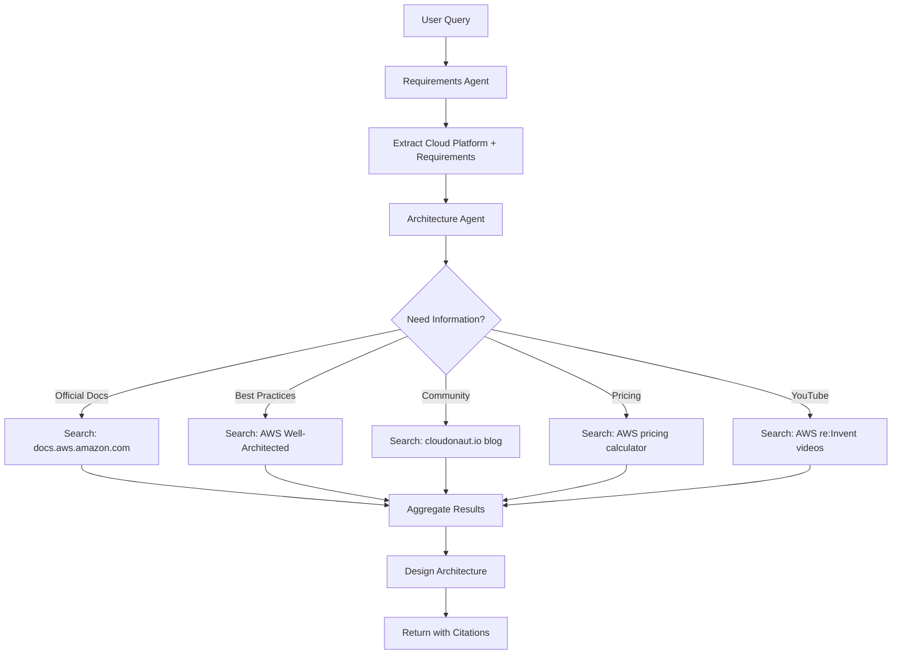

# Data Sources Strategy

**Project:** Co-Pilot for Solution Engineers  
**Version:** 2.0 (Multi-Cloud POC)  
**Date:** October 31, 2025

---

## Table of Contents

1. [Overview](#overview)
2. [Online-Only Strategy](#online-only-strategy)
3. [Bing Search Integration](#bing-search-integration)
4. [Official Cloud Documentation](#official-cloud-documentation)
5. [Trusted Community Sources](#trusted-community-sources)
6. [YouTube Transcript Extraction](#youtube-transcript-extraction)
7. [Public Pricing Sources](#public-pricing-sources)
8. [Search Strategy Per Cloud Platform](#search-strategy-per-cloud-platform)
9. [Citation Management](#citation-management)
10. [Data Quality & Validation](#data-quality--validation)

---

## Overview

### Philosophy

Co-Pilot SE uses an **online-only** data retrieval strategy for the POC phase. This means:

❌ **NO persistent knowledge base**  
❌ **NO document upload or ingestion pipeline**  
❌ **NO vector store or RAG system**  
❌ **NO authentication to cloud provider APIs**  

✅ **Real-time web search** via Bing Search API  
✅ **Direct access** to official cloud documentation  
✅ **Curated trusted sources** (blogs, YouTube channels)  
✅ **Public pricing calculators** (no API keys needed)  

### Rationale

| Benefit | Description |
|---------|-------------|
| **Always Current** | No stale data; always accessing latest documentation |
| **Zero Maintenance** | No ingestion pipelines, refresh jobs, or version control |
| **Simplified Infrastructure** | No vector store, no SQL database, no blob storage for POC |
| **Fast to Implement** | 2-3 weeks vs. 8-10 weeks for full RAG system |
| **POC-Appropriate** | Validates architecture generation before investing in storage infrastructure |

### Future Phases (Post-POC)

After POC validation, we may add:
- Document upload capability for customer-specific content
- Vector store for frequently accessed reference architectures
- RAG system for proprietary Microsoft content
- Caching layer for repeated queries

---

## Online-Only Strategy

### How It Works



### Agent Search Workflow

Each agent invokes Bing Search as needed:

1. **Requirements Agent**  
   - Searches for: industry-specific cloud patterns, compliance requirements
   - Example: "Azure healthcare architecture HIPAA compliance"

2. **Architecture Agent**  
   - Searches for: service documentation, reference architectures, best practices
   - Example: "AWS Lambda pricing tiers 2025", "GCP Cloud Run vs Cloud Functions"

3. **Cost Agent**  
   - Searches for: pricing pages, cost calculators, pricing comparison guides
   - Example: "Azure App Service pricing calculator", "AWS EC2 pricing us-east-1"

4. **Documentation Agent**  
   - Searches for: diagram examples, HLD templates, icon sets
   - Example: "AWS architecture diagram icons", "Azure HLD template"

---

## Bing Search Integration

### Bing Search API Configuration

```yaml
bing_search:
  api_endpoint: "https://api.bing.microsoft.com/v7.0/search"
  subscription_tier: "S1"  # 3M transactions/month
  cost_per_1000_queries: "$3.00"
  
  default_parameters:
    count: 10  # Results per query
    responseFilter: ["Webpages"]
    freshness: "Month"  # Prefer recent content
    safeSearch: "Strict"
    
  rate_limits:
    queries_per_second: 10
    queries_per_month: 100000  # For POC (10 users)
```

### Search Query Construction

#### Basic Search Pattern

```python
def construct_search_query(topic: str, cloud: str, source_type: str = "any"):
    """
    Build optimized Bing Search queries for cloud architecture information
    """
    
    # Base query
    query_parts = [topic, cloud]
    
    # Add source type constraints
    if source_type == "official_docs":
        if cloud == "aws":
            query_parts.append("site:docs.aws.amazon.com OR site:aws.amazon.com/blogs")
        elif cloud == "azure":
            query_parts.append("site:learn.microsoft.com OR site:azure.microsoft.com")
        elif cloud == "gcp":
            query_parts.append("site:cloud.google.com")
        elif cloud == "oracle":
            query_parts.append("site:docs.oracle.com")
    
    elif source_type == "community":
        # Use curated community sources
        community_sites = get_trusted_sources(cloud)
        site_filters = " OR ".join([f"site:{site}" for site in community_sites])
        query_parts.append(f"({site_filters})")
    
    elif source_type == "pricing":
        query_parts.append("pricing OR cost OR calculator")
        if cloud == "aws":
            query_parts.append("site:aws.amazon.com/pricing OR site:calculator.aws")
        elif cloud == "azure":
            query_parts.append("site:azure.microsoft.com/pricing")
        elif cloud == "gcp":
            query_parts.append("site:cloud.google.com/pricing")
    
    elif source_type == "youtube":
        query_parts.append("site:youtube.com")
    
    # Add year to prefer recent content
    query_parts.append("2024 OR 2025")
    
    return " ".join(query_parts)
```

#### Example Queries

**Architecture Research:**
```python
# Search for AWS Lambda best practices
query = "AWS Lambda best practices 2025 site:docs.aws.amazon.com OR site:aws.amazon.com/blogs"

# Search for Azure App Service architecture
query = "Azure App Service high availability architecture 2025 site:learn.microsoft.com"

# Search for GCP Cloud Run patterns
query = "GCP Cloud Run microservices architecture 2025 site:cloud.google.com"
```

**Community Sources:**
```python
# Search John Savill for Azure networking
query = "Azure networking best practices site:youtube.com/@NTFAQGuy OR site:savilltech.com 2024"

# Search cloudonaut for AWS multi-account
query = "AWS multi-account strategy site:cloudonaut.io 2024"
```

**Pricing Information:**
```python
# Search for Azure SQL pricing
query = "Azure SQL Database pricing calculator 2025 site:azure.microsoft.com/pricing"

# Search for AWS EC2 pricing
query = "AWS EC2 pricing us-east-1 2025 site:aws.amazon.com/ec2/pricing"
```

### Search Result Processing

```python
async def process_bing_results(search_response):
    """
    Extract and structure Bing Search results
    """
    processed_results = []
    
    for result in search_response.get("webPages", {}).get("value", []):
        processed_result = {
            "title": result["name"],
            "url": result["url"],
            "snippet": result["snippet"],
            "date_published": result.get("datePublished"),
            "source_type": classify_source(result["url"]),
            "relevance_score": calculate_relevance(result),
            "cloud_provider": detect_cloud_provider(result["url"]),
            "is_official": is_official_source(result["url"])
        }
        
        # Extract key information from snippet
        processed_result["extracted_info"] = extract_structured_info(
            result["snippet"],
            processed_result["source_type"]
        )
        
        processed_results.append(processed_result)
    
    # Sort by relevance and official sources first
    processed_results.sort(
        key=lambda x: (x["is_official"], x["relevance_score"]),
        reverse=True
    )
    
    return processed_results

def classify_source(url: str) -> str:
    """
    Classify source type based on URL
    """
    if any(domain in url for domain in ["docs.aws.amazon.com", "learn.microsoft.com", "cloud.google.com", "docs.oracle.com"]):
        return "official_documentation"
    elif any(domain in url for domain in ["aws.amazon.com/blogs", "azure.microsoft.com/blog"]):
        return "official_blog"
    elif "youtube.com" in url:
        return "video"
    elif any(domain in url for domain in ["cloudonaut.io", "savilltech.com", "thomasmaurer.ch"]):
        return "trusted_community"
    else:
        return "general_web"

def is_official_source(url: str) -> bool:
    """
    Determine if source is official cloud provider documentation
    """
    official_domains = [
        "docs.aws.amazon.com",
        "aws.amazon.com",
        "learn.microsoft.com",
        "azure.microsoft.com",
        "cloud.google.com",
        "docs.oracle.com",
        "oracle.com/cloud"
    ]
    return any(domain in url for domain in official_domains)
```

### Rate Limiting & Caching

```python
class BingSearchClient:
    def __init__(self):
        self.cache = {}  # In-memory cache for session
        self.rate_limiter = RateLimiter(queries_per_second=10)
        
    async def search(self, query: str, use_cache: bool = True):
        """
        Search with rate limiting and caching
        """
        # Check cache first
        if use_cache and query in self.cache:
            cache_age = datetime.now() - self.cache[query]["timestamp"]
            if cache_age < timedelta(hours=1):  # Cache for 1 hour
                return self.cache[query]["results"]
        
        # Rate limit
        await self.rate_limiter.acquire()
        
        # Execute search
        results = await self._execute_bing_search(query)
        
        # Cache results
        self.cache[query] = {
            "results": results,
            "timestamp": datetime.now()
        }
        
        return results
```

---

## Official Cloud Documentation

### Direct Access Strategy

For each cloud platform, we define the primary documentation URLs to prioritize in searches:

### AWS Documentation

```yaml
aws_docs:
  base_url: "https://docs.aws.amazon.com/"
  priority_sections:
    - "https://docs.aws.amazon.com/whitepapers/latest/aws-overview/"
    - "https://aws.amazon.com/architecture/well-architected/"
    - "https://aws.amazon.com/blogs/architecture/"
    - "https://docs.aws.amazon.com/prescriptive-guidance/"
  
  search_patterns:
    service_docs: "site:docs.aws.amazon.com {service_name}"
    best_practices: "site:aws.amazon.com/blogs/architecture {topic}"
    well_architected: "site:aws.amazon.com/architecture/well-architected {pillar}"
```

### Azure Documentation

```yaml
azure_docs:
  base_url: "https://learn.microsoft.com/"
  priority_sections:
    - "https://learn.microsoft.com/azure/architecture/"
    - "https://learn.microsoft.com/azure/well-architected/"
    - "https://learn.microsoft.com/azure/cloud-adoption-framework/"
    - "https://azure.microsoft.com/blog/"
  
  search_patterns:
    service_docs: "site:learn.microsoft.com/azure/{service_name}"
    architecture: "site:learn.microsoft.com/azure/architecture {pattern}"
    caf: "site:learn.microsoft.com/azure/cloud-adoption-framework {topic}"
```

### GCP Documentation

```yaml
gcp_docs:
  base_url: "https://cloud.google.com/docs"
  priority_sections:
    - "https://cloud.google.com/architecture"
    - "https://cloud.google.com/blog"
    - "https://cloud.google.com/architecture/framework"
  
  search_patterns:
    service_docs: "site:cloud.google.com/docs/{service_name}"
    architecture: "site:cloud.google.com/architecture {pattern}"
    best_practices: "site:cloud.google.com {service} best practices"
```

### Oracle Cloud Documentation

```yaml
oci_docs:
  base_url: "https://docs.oracle.com/en-us/iaas/"
  priority_sections:
    - "https://docs.oracle.com/en/solutions/"
    - "https://www.oracle.com/cloud/architecture/"
    - "https://blogs.oracle.com/cloud-infrastructure"
  
  search_patterns:
    service_docs: "site:docs.oracle.com/iaas {service_name}"
    architecture: "site:oracle.com/cloud/architecture {pattern}"
    best_practices: "site:docs.oracle.com {service} best practices"
```

### Documentation Search Workflow

```python
async def search_official_docs(cloud: str, service: str, topic: str):
    """
    Search official cloud documentation with fallback strategy
    """
    
    # Step 1: Build primary query (official docs site)
    primary_query = construct_search_query(
        topic=f"{service} {topic}",
        cloud=cloud,
        source_type="official_docs"
    )
    
    primary_results = await bing_search(primary_query, count=5)
    
    # Step 2: If insufficient results, search broader
    if len(primary_results) < 3:
        broader_query = f"{cloud} {service} {topic} 2024 OR 2025"
        secondary_results = await bing_search(broader_query, count=10)
        
        # Filter for official sources
        primary_results.extend([
            r for r in secondary_results 
            if is_official_source(r["url"])
        ])
    
    # Step 3: Rank by relevance and freshness
    ranked_results = rank_by_relevance_and_freshness(primary_results)
    
    return ranked_results[:5]  # Return top 5
```

---

## Trusted Community Sources

### Curated Source Lists

We maintain curated lists of trusted community sources per cloud platform (see `00-project-overview.md` for complete list).

### Source Validation Strategy

```python
TRUSTED_SOURCES = {
    "azure": [
        "youtube.com/@NTFAQGuy",  # John Savill
        "savilltech.com",
        "thomasmaurer.ch",
        "aidanfinn.com",
        "build5nines.com",
        "marczak.io",
        "learn.microsoft.com",
        "azure.microsoft.com"
    ],
    "aws": [
        "cloudonaut.io",
        "lastweekinaws.com",
        "allthingsdistributed.com",  # Werner Vogels
        "aws.amazon.com/blogs",
        "docs.aws.amazon.com",
        "youtube.com/@AWSEvents"
    ],
    "gcp": [
        "cloud.google.com",
        "youtube.com/@googlecloudtech",
        "medium.com/google-cloud",
        "kubernetes.io"
    ],
    "oracle": [
        "ateam-oracle.com",
        "blogs.oracle.com/cloud-infrastructure",
        "docs.oracle.com",
        "community.oracle.com"
    ]
}

def is_trusted_source(url: str, cloud: str) -> bool:
    """
    Check if URL is from a trusted community source
    """
    trusted_domains = TRUSTED_SOURCES.get(cloud, [])
    return any(domain in url for domain in trusted_domains)

def filter_trusted_sources(search_results: list, cloud: str) -> list:
    """
    Filter search results to only trusted sources
    """
    return [
        result for result in search_results
        if is_trusted_source(result["url"], cloud) or is_official_source(result["url"])
    ]
```

### Community Source Search

```python
async def search_community_sources(cloud: str, topic: str):
    """
    Search trusted community sources for practical guidance
    """
    
    # Build query targeting trusted sources
    trusted_domains = TRUSTED_SOURCES[cloud]
    site_filters = " OR ".join([f"site:{domain}" for domain in trusted_domains])
    
    query = f"{topic} {cloud} 2024 OR 2025 ({site_filters})"
    
    results = await bing_search(query, count=10)
    
    # Annotate with source credibility
    for result in results:
        result["source_credibility"] = assess_source_credibility(
            result["url"],
            cloud
        )
    
    return results

def assess_source_credibility(url: str, cloud: str) -> dict:
    """
    Assess credibility of community source
    """
    if is_official_source(url):
        return {
            "level": "official",
            "score": 1.0,
            "reasoning": "Official cloud provider documentation"
        }
    
    # Check against trusted list
    for domain in TRUSTED_SOURCES[cloud]:
        if domain in url:
            return {
                "level": "trusted_community",
                "score": 0.9,
                "reasoning": f"Curated trusted source: {domain}"
            }
    
    return {
        "level": "general_web",
        "score": 0.5,
        "reasoning": "General web source, verify information"
    }
```

---

## YouTube Transcript Extraction

### Strategy

For trusted YouTube channels (John Savill, AWS re:Invent, Google Cloud Next), we extract transcripts to enable text-based search of video content.

### YouTube Data API Integration

```yaml
youtube_api:
  api_endpoint: "https://www.googleapis.com/youtube/v3"
  quota_limit: 10000  # Units per day
  cost: "Free tier"
  
  operations:
    - search: 100 units per query
    - captions: 50 units per video
    - video_details: 1 unit per video
```

### Transcript Extraction Process

```python
from youtube_transcript_api import YouTubeTranscriptApi

async def search_youtube_videos(cloud: str, topic: str):
    """
    Search YouTube for relevant videos from trusted channels
    """
    
    # Trusted channels per cloud
    trusted_channels = {
        "azure": ["UC-MXgaFhsYU8PkqgKBdnusQ"],  # John Savill channel ID
        "aws": ["UCd6MoB9NC6uYN2grvUNT-Zg"],  # AWS Events
        "gcp": ["UCTMRxtyHoE3LPcrl-kT4AQQ"]  # Google Cloud Tech
    }
    
    channel_ids = trusted_channels.get(cloud, [])
    
    # Search YouTube API
    search_query = f"{topic} {cloud} tutorial OR deep dive OR architecture"
    
    videos = await youtube_api.search(
        q=search_query,
        channelId=",".join(channel_ids),
        type="video",
        order="relevance",
        publishedAfter="2024-01-01T00:00:00Z",  # Recent videos only
        maxResults=5
    )
    
    return videos

async def extract_transcript(video_id: str):
    """
    Extract and process video transcript
    """
    try:
        # Get transcript
        transcript_list = YouTubeTranscriptApi.get_transcript(video_id)
        
        # Combine into full text
        full_text = " ".join([item["text"] for item in transcript_list])
        
        # Extract key sections (timestamps + text)
        sections = extract_key_sections(transcript_list)
        
        return {
            "video_id": video_id,
            "full_transcript": full_text,
            "sections": sections,
            "duration_seconds": transcript_list[-1]["start"] + transcript_list[-1]["duration"],
            "extracted_at": datetime.now()
        }
        
    except Exception as e:
        # Transcript not available
        return {
            "video_id": video_id,
            "error": str(e),
            "transcript_available": False
        }

def extract_key_sections(transcript_items: list) -> list:
    """
    Extract key sections from transcript with timestamps
    """
    sections = []
    current_section = {"text": "", "start": 0}
    
    for item in transcript_items:
        # Detect section breaks (pauses >3 seconds)
        if len(current_section["text"]) > 0 and item["start"] - current_section["start"] > 3:
            if len(current_section["text"]) > 200:  # Meaningful sections only
                sections.append(current_section)
            current_section = {"text": "", "start": item["start"]}
        
        current_section["text"] += " " + item["text"]
    
    # Add last section
    if len(current_section["text"]) > 200:
        sections.append(current_section)
    
    return sections

async def search_video_transcript(video_id: str, query: str):
    """
    Search within a video transcript for specific topic
    """
    transcript = await extract_transcript(video_id)
    
    if not transcript.get("transcript_available", True):
        return None
    
    # Simple keyword search (could enhance with semantic search)
    matching_sections = []
    for section in transcript["sections"]:
        if any(keyword.lower() in section["text"].lower() for keyword in query.split()):
            matching_sections.append({
                "timestamp": format_timestamp(section["start"]),
                "text": section["text"][:300] + "...",
                "video_link": f"https://youtube.com/watch?v={video_id}&t={int(section['start'])}s"
            })
    
    return matching_sections

def format_timestamp(seconds: float) -> str:
    """Convert seconds to MM:SS format"""
    minutes = int(seconds // 60)
    secs = int(seconds % 60)
    return f"{minutes:02d}:{secs:02d}"
```

### Example Workflow

```python
# Agent searches for Azure networking best practices
youtube_results = await search_youtube_videos("azure", "networking best practices")

# Extract transcript from top result (John Savill video)
transcript = await extract_transcript(youtube_results[0]["video_id"])

# Search transcript for specific concepts
sections = await search_video_transcript(
    youtube_results[0]["video_id"],
    "hub spoke topology"
)

# Return citation with timestamp
citation = {
    "source": "John Savill's Azure Master Class",
    "url": f"https://youtube.com/watch?v={youtube_results[0]['video_id']}&t={sections[0]['timestamp']}",
    "excerpt": sections[0]["text"],
    "source_type": "video_transcript"
}
```

---

## Public Pricing Sources

### Strategy

Access public pricing information **without** authenticating to cloud provider APIs. Use:

1. **Public pricing calculators** (web-based)
2. **Bing Search** for pricing pages
3. **Curated pricing guides** (quarterly updated)

### Pricing Calculator URLs

```yaml
pricing_calculators:
  aws:
    calculator: "https://calculator.aws/"
    pricing_pages: "https://aws.amazon.com/pricing/"
    
  azure:
    calculator: "https://azure.microsoft.com/pricing/calculator/"
    pricing_pages: "https://azure.microsoft.com/pricing/"
    
  gcp:
    calculator: "https://cloud.google.com/products/calculator"
    pricing_pages: "https://cloud.google.com/pricing"
    
  oracle:
    calculator: "https://www.oracle.com/cloud/cost-estimator.html"
    pricing_pages: "https://www.oracle.com/cloud/price-list/"
```

### Pricing Search Strategy

```python
async def search_pricing_info(cloud: str, service: str, region: str = None):
    """
    Search for pricing information using public sources
    """
    
    # Build pricing-specific query
    query_parts = [cloud, service, "pricing", "2025"]
    
    if region:
        query_parts.append(region)
    
    # Add site filter for official pricing pages
    if cloud == "aws":
        site_filter = "site:aws.amazon.com/pricing OR site:calculator.aws"
    elif cloud == "azure":
        site_filter = "site:azure.microsoft.com/pricing"
    elif cloud == "gcp":
        site_filter = "site:cloud.google.com/pricing"
    elif cloud == "oracle":
        site_filter = "site:oracle.com/cloud/price-list"
    
    query = f"{' '.join(query_parts)} {site_filter}"
    
    results = await bing_search(query, count=5)
    
    # Extract pricing information from results
    pricing_data = []
    for result in results:
        pricing_info = extract_pricing_from_snippet(
            result["snippet"],
            service,
            cloud
        )
        if pricing_info:
            pricing_data.append({
                "source_url": result["url"],
                "pricing": pricing_info,
                "last_updated": result.get("datePublished"),
                "source_type": "official_pricing_page"
            })
    
    return pricing_data

def extract_pricing_from_snippet(snippet: str, service: str, cloud: str) -> dict:
    """
    Extract pricing information from search result snippet
    
    Examples from snippets:
    - "Starting at $0.05 per hour"
    - "Pay as you go pricing from $0.10/GB"
    - "$100/month for standard tier"
    """
    
    import re
    
    # Regex patterns for pricing
    patterns = [
        r'\$(\d+(?:\.\d{2})?)\s*(?:per|/)\s*(\w+)',  # $0.05 per hour
        r'Starting at \$(\d+(?:\.\d{2})?)',  # Starting at $100
        r'\$(\d+(?:,\d{3})*(?:\.\d{2})?)\s*/\s*month',  # $1,500/month
    ]
    
    extracted = {}
    
    for pattern in patterns:
        matches = re.findall(pattern, snippet, re.IGNORECASE)
        if matches:
            extracted["pricing_found"] = True
            extracted["raw_text"] = snippet
            extracted["matches"] = matches
            break
    
    return extracted if extracted else None

async def estimate_cost_from_public_sources(
    cloud: str,
    service: str,
    region: str,
    configuration: dict
):
    """
    Estimate costs using public pricing information
    
    Returns cost estimate with disclaimer about accuracy
    """
    
    # Search for pricing info
    pricing_sources = await search_pricing_info(cloud, service, region)
    
    if not pricing_sources:
        return {
            "estimated_monthly_cost": None,
            "confidence": "low",
            "message": "Pricing information not available from public sources. Please consult cloud provider pricing calculator."
        }
    
    # Attempt to calculate based on configuration
    # This is heuristic-based and may not be 100% accurate
    base_cost = extract_base_cost(pricing_sources[0])
    
    if base_cost:
        # Apply configuration multipliers
        multiplier = calculate_usage_multiplier(configuration)
        estimated_cost = base_cost * multiplier
        
        return {
            "estimated_monthly_cost": estimated_cost,
            "currency": "USD",
            "confidence": "medium",
            "assumptions": [
                "Based on public pricing as of 2025",
                f"Assuming {configuration.get('hours_per_month', 730)} hours/month",
                "No reserved instances or discounts applied",
                "Standard support tier"
            ],
            "sources": [s["source_url"] for s in pricing_sources],
            "disclaimer": "This is a preliminary estimate. Actual costs may vary significantly based on usage, discounts, and other factors. Consult official pricing calculator for accurate quotes."
        }
    
    return {
        "estimated_monthly_cost": None,
        "confidence": "low",
        "message": "Unable to parse pricing from public sources. Manual pricing research required."
    }
```

### Curated Pricing Guides

Maintain quarterly-updated pricing guides:

```yaml
pricing_guides:
  last_updated: "2025-10-01"
  next_update: "2026-01-01"
  
  aws_compute:
    t3.medium:
      regions:
        us-east-1: 0.0416  # USD per hour
        eu-west-1: 0.0468
        ap-southeast-1: 0.0520
    
  azure_compute:
    b1s:
      regions:
        eastus: 0.0104  # USD per hour
        westeurope: 0.0124
        
  # ... other services
```

**Update Process:**
- Quarterly review of pricing pages
- Manual extraction and validation
- Store in configuration file (YAML/JSON)
- Use as fallback when Bing Search fails

---

## Search Strategy Per Cloud Platform

### AWS Search Strategy

```python
AWS_SEARCH_STRATEGY = {
    "service_documentation": {
        "query_template": "AWS {service} documentation site:docs.aws.amazon.com 2024 OR 2025",
        "top_results": 3
    },
    "reference_architecture": {
        "query_template": "AWS {use_case} reference architecture site:aws.amazon.com/blogs/architecture 2024",
        "top_results": 5
    },
    "well_architected": {
        "query_template": "AWS Well-Architected {pillar} site:aws.amazon.com/architecture/well-architected",
        "top_results": 3
    },
    "community_best_practices": {
        "query_template": "{topic} AWS best practices site:cloudonaut.io OR site:lastweekinaws.com 2024",
        "top_results": 3
    },
    "pricing": {
        "query_template": "AWS {service} pricing {region} site:aws.amazon.com/pricing 2025",
        "top_results": 2
    },
    "reinvent_videos": {
        "query_template": "AWS re:Invent {topic} site:youtube.com/@AWSEvents 2024",
        "top_results": 2
    }
}
```

### Azure Search Strategy

```python
AZURE_SEARCH_STRATEGY = {
    "service_documentation": {
        "query_template": "Azure {service} documentation site:learn.microsoft.com/azure 2024 OR 2025",
        "top_results": 3
    },
    "reference_architecture": {
        "query_template": "Azure {use_case} architecture site:learn.microsoft.com/azure/architecture 2024",
        "top_results": 5
    },
    "well_architected": {
        "query_template": "Azure Well-Architected {pillar} site:learn.microsoft.com/azure/well-architected",
        "top_results": 3
    },
    "caf_guidance": {
        "query_template": "Azure Cloud Adoption Framework {topic} site:learn.microsoft.com/azure/cloud-adoption-framework",
        "top_results": 3
    },
    "community_best_practices": {
        "query_template": "{topic} Azure (site:savilltech.com OR site:thomasmaurer.ch OR site:youtube.com/@NTFAQGuy) 2024",
        "top_results": 3
    },
    "pricing": {
        "query_template": "Azure {service} pricing calculator site:azure.microsoft.com/pricing 2025",
        "top_results": 2
    }
}
```

### GCP Search Strategy

```python
GCP_SEARCH_STRATEGY = {
    "service_documentation": {
        "query_template": "GCP {service} documentation site:cloud.google.com/docs 2024 OR 2025",
        "top_results": 3
    },
    "reference_architecture": {
        "query_template": "GCP {use_case} architecture site:cloud.google.com/architecture 2024",
        "top_results": 5
    },
    "best_practices": {
        "query_template": "GCP {service} best practices site:cloud.google.com 2024",
        "top_results": 3
    },
    "community": {
        "query_template": "{topic} GCP site:medium.com/google-cloud 2024",
        "top_results": 3
    },
    "pricing": {
        "query_template": "GCP {service} pricing calculator site:cloud.google.com/pricing 2025",
        "top_results": 2
    },
    "cloud_next_videos": {
        "query_template": "Google Cloud Next {topic} site:youtube.com/@googlecloudtech 2024",
        "top_results": 2
    }
}
```

### Oracle Cloud Search Strategy

```python
OCI_SEARCH_STRATEGY = {
    "service_documentation": {
        "query_template": "Oracle Cloud {service} documentation site:docs.oracle.com/iaas 2024 OR 2025",
        "top_results": 3
    },
    "reference_architecture": {
        "query_template": "Oracle Cloud {use_case} architecture site:oracle.com/cloud/architecture 2024",
        "top_results": 5
    },
    "best_practices": {
        "query_template": "OCI {service} best practices site:docs.oracle.com OR site:ateam-oracle.com 2024",
        "top_results": 3
    },
    "community": {
        "query_template": "{topic} Oracle Cloud site:blogs.oracle.com/cloud-infrastructure OR site:ateam-oracle.com 2024",
        "top_results": 3
    },
    "pricing": {
        "query_template": "Oracle Cloud {service} pricing site:oracle.com/cloud/price-list 2025",
        "top_results": 2
    }
}
```

---

## Citation Management

### Citation Schema

```python
class Citation:
    def __init__(
        self,
        source_url: str,
        title: str,
        excerpt: str,
        source_type: str,
        cloud_provider: str,
        accessed_date: datetime,
        published_date: datetime = None,
        is_official: bool = False,
        relevance_score: float = 0.0
    ):
        self.citation_id = generate_citation_id()
        self.source_url = source_url
        self.title = title
        self.excerpt = excerpt[:300]  # Limit excerpt length
        self.source_type = source_type  # official_docs, blog, video, community
        self.cloud_provider = cloud_provider
        self.accessed_date = accessed_date
        self.published_date = published_date
        self.is_official = is_official
        self.relevance_score = relevance_score
    
    def to_dict(self):
        return {
            "citation_id": self.citation_id,
            "source": self.title,
            "url": self.source_url,
            "excerpt": self.excerpt,
            "type": self.source_type,
            "cloud": self.cloud_provider,
            "official": self.is_official,
            "accessed": self.accessed_date.isoformat(),
            "published": self.published_date.isoformat() if self.published_date else None,
            "relevance": self.relevance_score
        }
```

### Citation Collection

```python
class CitationManager:
    def __init__(self):
        self.citations = []
    
    def add_from_search_result(self, search_result: dict, cloud: str):
        """
        Create citation from Bing Search result
        """
        citation = Citation(
            source_url=search_result["url"],
            title=search_result["name"],
            excerpt=search_result["snippet"],
            source_type=classify_source(search_result["url"]),
            cloud_provider=cloud,
            accessed_date=datetime.now(),
            published_date=parse_date(search_result.get("datePublished")),
            is_official=is_official_source(search_result["url"]),
            relevance_score=search_result.get("relevanceScore", 0.0)
        )
        
        self.citations.append(citation)
        return citation.citation_id
    
    def get_all_citations(self) -> list:
        """
        Return all citations sorted by relevance
        """
        sorted_citations = sorted(
            self.citations,
            key=lambda c: (c.is_official, c.relevance_score),
            reverse=True
        )
        return [c.to_dict() for c in sorted_citations]
    
    def get_citations_by_type(self, source_type: str) -> list:
        """
        Filter citations by source type
        """
        filtered = [c for c in self.citations if c.source_type == source_type]
        return [c.to_dict() for c in filtered]
```

### Citation Formatting

```python
def format_citation_for_hld(citation: Citation) -> str:
    """
    Format citation for inclusion in HLD document
    """
    if citation.source_type == "official_documentation":
        return f"[{citation.title}]({citation.source_url}) - Official {citation.cloud_provider.upper()} Documentation"
    
    elif citation.source_type == "video":
        timestamp = extract_timestamp_from_url(citation.source_url)
        return f"[{citation.title}]({citation.source_url}) - Video (timestamp: {timestamp})"
    
    else:
        source_label = "Official Blog" if citation.is_official else "Community Source"
        return f"[{citation.title}]({citation.source_url}) - {source_label}"

def generate_references_section(citations: list) -> str:
    """
    Generate markdown references section for HLD
    """
    md = "## References\n\n"
    
    # Group by type
    official_docs = [c for c in citations if c.source_type == "official_documentation"]
    blogs = [c for c in citations if c.source_type in ["official_blog", "community"]]
    videos = [c for c in citations if c.source_type == "video"]
    
    if official_docs:
        md += "### Official Documentation\n\n"
        for citation in official_docs:
            md += f"- {format_citation_for_hld(citation)}\n"
        md += "\n"
    
    if blogs:
        md += "### Blogs & Articles\n\n"
        for citation in blogs:
            md += f"- {format_citation_for_hld(citation)}\n"
        md += "\n"
    
    if videos:
        md += "### Videos\n\n"
        for citation in videos:
            md += f"- {format_citation_for_hld(citation)}\n"
        md += "\n"
    
    return md
```

---

## Data Quality & Validation

### Search Result Quality Scoring

```python
def calculate_result_quality_score(search_result: dict, cloud: str) -> float:
    """
    Score search result quality (0.0 - 1.0)
    """
    score = 0.5  # Base score
    
    # +0.3 for official source
    if is_official_source(search_result["url"]):
        score += 0.3
    
    # +0.2 for trusted community source
    elif is_trusted_source(search_result["url"], cloud):
        score += 0.2
    
    # +0.1 for recent content (within 1 year)
    if search_result.get("datePublished"):
        published_date = parse_date(search_result["datePublished"])
        age_days = (datetime.now() - published_date).days
        if age_days < 365:
            score += 0.1
    
    # +0.1 for strong relevance signal (title contains key terms)
    query_terms = search_result.get("query_terms", [])
    title_lower = search_result["name"].lower()
    if any(term.lower() in title_lower for term in query_terms):
        score += 0.1
    
    # -0.2 for very old content (>2 years)
    if search_result.get("datePublished"):
        published_date = parse_date(search_result["datePublished"])
        age_days = (datetime.now() - published_date).days
        if age_days > 730:
            score -= 0.2
    
    return max(0.0, min(1.0, score))
```

### Content Validation

```python
def validate_search_results(results: list, cloud: str, topic: str) -> dict:
    """
    Validate search results for quality and relevance
    """
    validation = {
        "total_results": len(results),
        "official_sources_count": 0,
        "trusted_community_count": 0,
        "recent_content_count": 0,  # <1 year old
        "average_quality_score": 0.0,
        "quality_threshold_met": False
    }
    
    quality_scores = []
    
    for result in results:
        # Count source types
        if is_official_source(result["url"]):
            validation["official_sources_count"] += 1
        elif is_trusted_source(result["url"], cloud):
            validation["trusted_community_count"] += 1
        
        # Count recent content
        if result.get("datePublished"):
            age_days = (datetime.now() - parse_date(result["datePublished"])).days
            if age_days < 365:
                validation["recent_content_count"] += 1
        
        # Calculate quality score
        quality_score = calculate_result_quality_score(result, cloud)
        quality_scores.append(quality_score)
    
    # Calculate average quality
    if quality_scores:
        validation["average_quality_score"] = sum(quality_scores) / len(quality_scores)
        validation["quality_threshold_met"] = validation["average_quality_score"] >= 0.6
    
    return validation

def ensure_minimum_quality(results: list, cloud: str, min_official: int = 2):
    """
    Ensure minimum quality standards are met
    
    Raises exception if:
    - Fewer than min_official official sources
    - Average quality score < 0.5
    """
    validation = validate_search_results(results, cloud, "")
    
    issues = []
    
    if validation["official_sources_count"] < min_official:
        issues.append(f"Only {validation['official_sources_count']} official sources found (minimum: {min_official})")
    
    if validation["average_quality_score"] < 0.5:
        issues.append(f"Average quality score {validation['average_quality_score']:.2f} below threshold 0.5")
    
    if issues:
        raise DataQualityError(
            f"Search results do not meet quality standards: {', '.join(issues)}"
        )
    
    return True
```

### Error Handling

```python
class DataQualityError(Exception):
    """Raised when search results don't meet quality standards"""
    pass

class InsufficientDataError(Exception):
    """Raised when not enough data available for architecture design"""
    pass

async def search_with_fallback(cloud: str, topic: str, max_retries: int = 3):
    """
    Search with fallback strategies if initial search fails
    """
    
    for attempt in range(max_retries):
        try:
            # Primary search: official docs + trusted sources
            results = await search_official_and_trusted(cloud, topic)
            
            # Validate quality
            ensure_minimum_quality(results, cloud, min_official=2)
            
            return results
            
        except DataQualityError as e:
            if attempt < max_retries - 1:
                # Fallback 1: Broaden search (remove date filter)
                results = await search_broader(cloud, topic)
                
                try:
                    ensure_minimum_quality(results, cloud, min_official=1)  # Lower threshold
                    return results
                except DataQualityError:
                    # Fallback 2: Search general web (warn user)
                    results = await search_general_web(cloud, topic)
                    
                    # Warn that quality may be lower
                    for result in results:
                        result["quality_warning"] = "General web source - verify information"
                    
                    return results
            else:
                raise InsufficientDataError(
                    f"Unable to find sufficient quality data for {cloud} {topic} after {max_retries} attempts"
                )
```

---

## Cost & Performance Metrics

### Expected Search Volume (POC)

```yaml
poc_metrics:
  users: 10
  architectures_per_user_per_month: 20
  searches_per_architecture: 15
  
  total_monthly_searches: 3000  # 10 users × 20 arch × 15 searches
  
  bing_search_cost:
    queries_per_month: 3000
    cost_per_1000: $3.00
    monthly_cost: $9.00
  
  youtube_api_cost:
    queries_per_month: 200  # Subset of searches
    cost: "Free tier (10K units/day)"
    monthly_cost: $0.00
  
  total_data_sources_cost: $9.00
```

### Performance Targets

| Metric | Target | Rationale |
|--------|--------|-----------|
| **Search latency** | <2 seconds | Bing Search API avg: 200-500ms |
| **Transcript extraction** | <5 seconds | YouTube API call + processing |
| **Total research time** | <30 seconds | For Architecture Agent research phase |
| **Cache hit rate** | >40% | Repeated queries benefit from cache |
| **Source quality score** | >0.7 | Ensure majority are official/trusted sources |

---

**Last Updated:** October 31, 2025  
**Document Owner:** Data & AI Team  
**Version:** 2.0 (Multi-Cloud POC)
