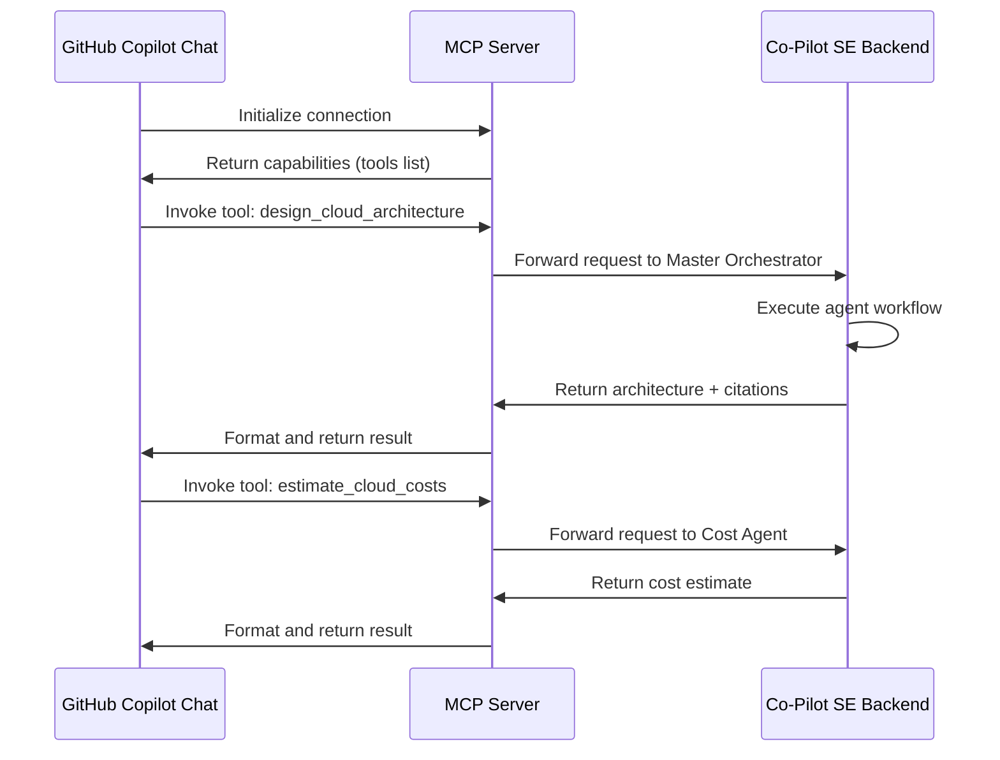
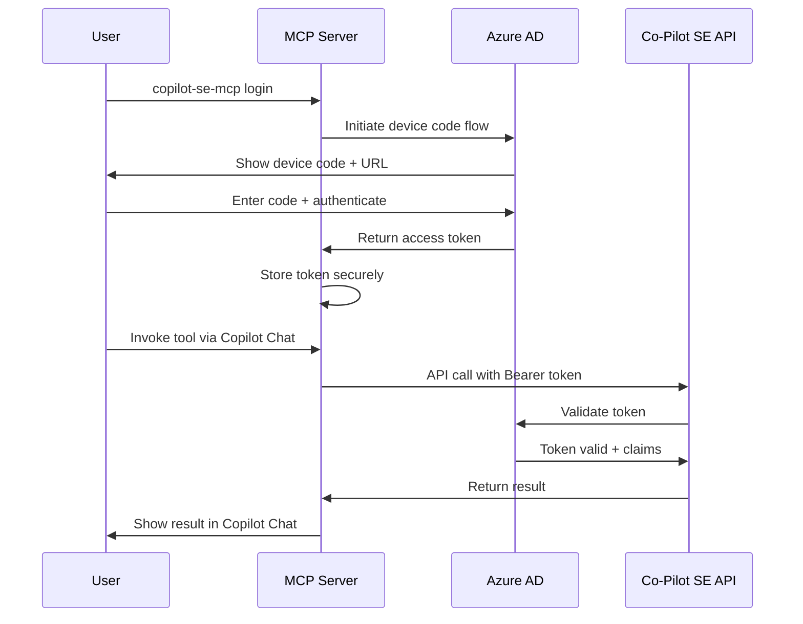

# Model Context Protocol (MCP) Integration Specification

**Project:** Co-Pilot for Solution Engineers  
**Version:** 2.0 (Multi-Cloud POC)  
**Date:** October 31, 2025

---

## Table of Contents

1. [Overview](#overview)
2. [MCP Protocol Basics](#mcp-protocol-basics)
3. [MCP Server Architecture](#mcp-server-architecture)
4. [Exposed Tools](#exposed-tools)
5. [GitHub Copilot Chat Integration](#github-copilot-chat-integration)
6. [Authentication & Authorization](#authentication--authorization)
7. [Request/Response Schemas](#requestresponse-schemas)
8. [Error Handling](#error-handling)
9. [Implementation Guide](#implementation-guide)

---

## Overview

### What is MCP?

The **Model Context Protocol (MCP)** is an open protocol that standardizes how applications provide context to LLMs. It enables:

- **Tools**: Functions that LLMs can invoke
- **Resources**: Data and content that LLMs can read
- **Prompts**: Reusable prompt templates

### Why MCP for Co-Pilot SE?

MCP integration allows Co-Pilot SE to be invoked from:

1. **GitHub Copilot Chat** - Developers can design cloud architectures from VS Code
2. **Other MCP-compatible tools** - Extend Co-Pilot reach beyond standalone UI
3. **Workflow automation** - Integrate architecture generation into CI/CD pipelines

### Integration Priority

🥇 **Primary Interface:** Web Portal + Teams Bot  
🥈 **Secondary Interface:** MCP (for GitHub Copilot Chat integration)

MCP is **not** exposed to the entire application UI—it's a specialized interface for external tool integration.

---

## MCP Protocol Basics

### Protocol Specification

```yaml
protocol:
  name: "Model Context Protocol (MCP)"
  version: "1.0"
  spec_url: "https://spec.modelcontextprotocol.io/specification/"
  
  capabilities:
    - tools  # Function calls
    - resources  # Read-only data access
    - prompts  # Reusable templates
  
  transport:
    - stdio  # Standard input/output (for local clients)
    - http  # HTTP/HTTPS (for remote clients)
```

### Communication Flow



---

## MCP Server Architecture

### High-Level Design

```
┌─────────────────────────────────────────────────────┐
│          GitHub Copilot Chat (Client)               │
└─────────────────┬───────────────────────────────────┘
                  │ MCP Protocol (JSON-RPC)
                  ↓
┌─────────────────────────────────────────────────────┐
│              MCP Server (Node.js/Python)            │
│  ┌──────────────┬──────────────┬─────────────────┐  │
│  │ Tool Handler │ Auth Layer   │ Request Router  │  │
│  └──────────────┴──────────────┴─────────────────┘  │
└─────────────────┬───────────────────────────────────┘
                  │ REST API
                  ↓
┌─────────────────────────────────────────────────────┐
│         Co-Pilot SE Backend (Azure Functions)       │
│  ┌──────────────────────────────────────────────┐   │
│  │        Master Orchestrator Agent             │   │
│  │  ┌─────────┬─────────┬──────────┬─────────┐  │   │
│  │  │ Req Agt │ Arch Agt│ Cost Agt │ Doc Agt │  │   │
│  │  └─────────┴─────────┴──────────┴─────────┘  │   │
│  └──────────────────────────────────────────────┘   │
└─────────────────────────────────────────────────────┘
```

### Technology Stack

```yaml
mcp_server:
  runtime: "Node.js 20 LTS" # or Python 3.11+
  framework: "@modelcontextprotocol/sdk"
  hosting: "Azure Functions (Node.js runtime)"
  
  dependencies:
    - "@modelcontextprotocol/sdk": "^1.0.0"
    - "axios": "^1.6.0"  # For calling Co-Pilot backend
    - "jsonwebtoken": "^9.0.0"  # For JWT handling
    
authentication:
  method: "Azure AD OAuth 2.0"
  token_endpoint: "https://login.microsoftonline.com/{tenant}/oauth2/v2.0/token"
  
deployment:
  region: "Sweden Central"
  tier: "Consumption Plan"
  estimated_cost: "$20/month (POC)"
```

---

## Exposed Tools

Co-Pilot SE exposes **3 MCP tools** to GitHub Copilot Chat:

### Tool 1: `design_cloud_architecture`

**Purpose:** Design a complete cloud architecture from natural language requirements

**Input Parameters:**

```typescript
interface DesignArchitectureParams {
  requirements: string;  // Natural language description
  cloud_platform: "aws" | "azure" | "gcp" | "oracle";
  industry_vertical?: "public_sector" | "healthcare" | "finance" | "retail" | "manufacturing" | "general";
  region?: string;  // Optional preferred region
  budget?: string;  // Optional budget constraint
}
```

**Example Usage (in GitHub Copilot Chat):**

```
@copilot-se design a scalable AWS e-commerce platform for 10K concurrent users with 
product catalog, shopping cart, payment processing, and order management. Budget $5K/month.
```

**Output:**

```typescript
interface ArchitectureResponse {
  status: "success" | "needs_clarification" | "error";
  
  // If needs_clarification
  clarifying_questions?: string[];
  
  // If success
  architecture?: {
    overview: string;
    components: Array<{
      name: string;
      services: string[];
      description: string;
      justification: string;
    }>;
    diagram_description: string;
  };
  
  cost_estimate?: {
    monthly_low: number;
    monthly_estimated: number;
    monthly_high: number;
    currency: string;
  };
  
  citations: Array<{
    source: string;
    url: string;
    type: string;
  }>;
  
  execution_time_seconds: number;
}
```

---

### Tool 2: `estimate_cloud_costs`

**Purpose:** Estimate costs for an existing architecture or specific services

**Input Parameters:**

```typescript
interface EstimateCostsParams {
  cloud_platform: "aws" | "azure" | "gcp" | "oracle";
  services: Array<{
    service_name: string;
    configuration: Record<string, any>;  // Service-specific config
  }>;
  region: string;
  usage_scenario?: "low" | "medium" | "high";
}
```

**Example Usage:**

```
@copilot-se estimate costs for Azure: App Service (3 instances, Standard S1), 
SQL Database (Standard S2), 100GB Blob Storage, Application Gateway in West Europe
```

**Output:**

```typescript
interface CostEstimateResponse {
  status: "success" | "error";
  
  summary: {
    monthly_low: number;
    monthly_estimated: number;
    monthly_high: number;
    currency: string;
    confidence: "high" | "medium" | "low";
  };
  
  breakdown: {
    compute: { monthly_cost: number; services: Array<any> };
    storage: { monthly_cost: number; services: Array<any> };
    database: { monthly_cost: number; services: Array<any> };
    networking: { monthly_cost: number; services: Array<any> };
    other: { monthly_cost: number; services: Array<any> };
  };
  
  assumptions: string[];
  disclaimer: string;
  sources: Array<{ source: string; url: string }>;
}
```

---

### Tool 3: `generate_architecture_documentation`

**Purpose:** Generate HLD and diagrams from an architecture description

**Input Parameters:**

```typescript
interface GenerateDocumentationParams {
  architecture: {
    cloud_platform: string;
    components: Array<{
      name: string;
      services: string[];
      description: string;
    }>;
  };
  include_cost_estimate?: boolean;
  output_format?: "markdown" | "drawio" | "png" | "pptx";
}
```

**Example Usage:**

```
@copilot-se generate documentation for the AWS architecture we just designed, 
include cost estimate, output as markdown and draw.io diagram
```

**Output:**

```typescript
interface DocumentationResponse {
  status: "success" | "error";
  
  hld_document: {
    format: string;
    content: string;  // Markdown content
  };
  
  diagrams?: {
    drawio_xml?: string;
    png_base64?: string;
    pptx_url?: string;
  };
  
  cost_summary?: {
    markdown_table: string;
    csv_data: string;
  };
  
  metadata: {
    generated_at: string;
    total_pages: number;
  };
}
```

---

## GitHub Copilot Chat Integration

### Setup for Users

**Step 1: Install Co-Pilot SE MCP Server**

```bash
# Via npm (if published)
npm install -g @copilot-se/mcp-server

# Or via configuration in VS Code settings.json
{
  "github.copilot.chat.mcpServers": {
    "copilot-se": {
      "command": "npx",
      "args": ["@copilot-se/mcp-server"],
      "env": {
        "COPILOT_SE_API_URL": "https://copilot-se.azurewebsites.net",
        "COPILOT_SE_TENANT_ID": "<your-tenant-id>"
      }
    }
  }
}
```

**Step 2: Authenticate**

```bash
# Run authentication flow (opens browser)
copilot-se-mcp login

# Or use device code flow
copilot-se-mcp login --device-code
```

**Step 3: Use in Copilot Chat**

```
# Design architecture
@copilot-se design an AWS Lambda-based API for processing images

# Estimate costs
@copilot-se estimate costs for GCP Cloud Run with 1M requests/month

# Generate documentation
@copilot-se generate docs for the architecture we designed
```

### Chat Commands

| Command | Tool | Description |
|---------|------|-------------|
| `@copilot-se design ...` | `design_cloud_architecture` | Design new architecture |
| `@copilot-se estimate ...` | `estimate_cloud_costs` | Calculate costs |
| `@copilot-se docs ...` | `generate_architecture_documentation` | Generate HLD/diagrams |
| `@copilot-se help` | N/A | Show available commands |

---

## Authentication & Authorization

### Azure AD OAuth 2.0 Flow



### Token Management

```typescript
class AuthManager {
  private tokenCache: Map<string, TokenInfo> = new Map();
  
  async getAccessToken(userId: string): Promise<string> {
    // Check cache
    const cached = this.tokenCache.get(userId);
    if (cached && !this.isTokenExpired(cached)) {
      return cached.accessToken;
    }
    
    // Refresh token
    const newToken = await this.refreshAccessToken(userId);
    this.tokenCache.set(userId, newToken);
    
    return newToken.accessToken;
  }
  
  private isTokenExpired(token: TokenInfo): boolean {
    const expiryTime = token.expiresAt;
    const now = Date.now();
    const bufferSeconds = 300; // 5 min buffer
    
    return (expiryTime - bufferSeconds * 1000) < now;
  }
  
  private async refreshAccessToken(userId: string): Promise<TokenInfo> {
    const refreshToken = await this.getStoredRefreshToken(userId);
    
    const response = await axios.post(
      `https://login.microsoftonline.com/${TENANT_ID}/oauth2/v2.0/token`,
      {
        client_id: CLIENT_ID,
        scope: "api://copilot-se/.default",
        refresh_token: refreshToken,
        grant_type: "refresh_token"
      }
    );
    
    return {
      accessToken: response.data.access_token,
      refreshToken: response.data.refresh_token,
      expiresAt: Date.now() + (response.data.expires_in * 1000)
    };
  }
}
```

### Authorization Scopes

```yaml
azure_ad_app:
  app_id: "<copilot-se-app-id>"
  tenant_id: "<tenant-id>"
  
  scopes:
    - "api://copilot-se/Architecture.Design"
    - "api://copilot-se/Cost.Estimate"
    - "api://copilot-se/Documentation.Generate"
  
  roles:
    - name: "Architect"
      description: "Can design architectures and estimate costs"
      allowed_tools: ["design_cloud_architecture", "estimate_cloud_costs", "generate_architecture_documentation"]
    
    - name: "Viewer"
      description: "Read-only access"
      allowed_tools: []  # MCP access disabled for viewers
```

---

## Request/Response Schemas

### Tool Invocation Format (JSON-RPC)

```json
{
  "jsonrpc": "2.0",
  "id": 1,
  "method": "tools/call",
  "params": {
    "name": "design_cloud_architecture",
    "arguments": {
      "requirements": "Build a scalable web application on AWS...",
      "cloud_platform": "aws",
      "industry_vertical": "retail",
      "budget": "$5000/month"
    }
  }
}
```

### Success Response

```json
{
  "jsonrpc": "2.0",
  "id": 1,
  "result": {
    "content": [
      {
        "type": "text",
        "text": "# AWS E-Commerce Architecture\n\n## Overview\n..."
      },
      {
        "type": "resource",
        "resource": {
          "uri": "copilot-se://architecture/20251031-001",
          "name": "Architecture Design",
          "mimeType": "application/json"
        }
      }
    ],
    "isError": false
  }
}
```

### Error Response

```json
{
  "jsonrpc": "2.0",
  "id": 1,
  "error": {
    "code": -32603,
    "message": "Internal error: Failed to contact Bing Search API",
    "data": {
      "errorType": "SearchAPIError",
      "retryable": true,
      "details": "Connection timeout after 30s"
    }
  }
}
```

---

## Error Handling

### Error Codes

```typescript
enum MCPErrorCode {
  // Standard JSON-RPC errors
  PARSE_ERROR = -32700,
  INVALID_REQUEST = -32600,
  METHOD_NOT_FOUND = -32601,
  INVALID_PARAMS = -32602,
  INTERNAL_ERROR = -32603,
  
  // Custom Co-Pilot SE errors
  AUTHENTICATION_REQUIRED = -32001,
  AUTHORIZATION_FAILED = -32002,
  QUOTA_EXCEEDED = -32003,
  BACKEND_UNAVAILABLE = -32004,
  NEEDS_CLARIFICATION = -32005
}
```

### Error Response Formats

**Authentication Error:**

```json
{
  "jsonrpc": "2.0",
  "id": 1,
  "error": {
    "code": -32001,
    "message": "Authentication required. Please run: copilot-se-mcp login",
    "data": {
      "login_url": "https://copilot-se.azurewebsites.net/login",
      "instructions": "Run 'copilot-se-mcp login' in terminal"
    }
  }
}
```

**Needs Clarification:**

```json
{
  "jsonrpc": "2.0",
  "id": 1,
  "result": {
    "content": [
      {
        "type": "text",
        "text": "I need more information to design this architecture:\n\n1. Which cloud platform do you prefer: AWS, Azure, GCP, or Oracle?\n2. How many concurrent users do you expect?\n3. What is your approximate monthly budget?"
      }
    ],
    "isError": false,
    "needsClarification": true
  }
}
```

### Retry Logic

```typescript
class MCPToolHandler {
  async callTool(toolName: string, params: any, retries: number = 2): Promise<any> {
    for (let attempt = 0; attempt <= retries; attempt++) {
      try {
        return await this.executeToolCall(toolName, params);
        
      } catch (error) {
        const isRetryable = this.isRetryableError(error);
        const isLastAttempt = attempt === retries;
        
        if (!isRetryable || isLastAttempt) {
          throw this.formatMCPError(error);
        }
        
        // Exponential backoff
        await this.sleep(Math.pow(2, attempt) * 1000);
      }
    }
  }
  
  private isRetryableError(error: any): boolean {
    return [
      "SearchAPIError",
      "TemporaryBackendError",
      "RateLimitError"
    ].includes(error.type);
  }
  
  private formatMCPError(error: any): MCPError {
    return {
      code: this.mapErrorCode(error.type),
      message: error.message,
      data: {
        errorType: error.type,
        retryable: this.isRetryableError(error),
        details: error.details
      }
    };
  }
}
```

---

## Implementation Guide

### Step 1: Setup MCP Server Project

```bash
# Create new Node.js project
mkdir copilot-se-mcp-server
cd copilot-se-mcp-server
npm init -y

# Install dependencies
npm install @modelcontextprotocol/sdk axios jsonwebtoken dotenv

# Install dev dependencies
npm install --save-dev @types/node typescript ts-node
```

### Step 2: Implement MCP Server

**`src/index.ts`:**

```typescript
import { Server } from "@modelcontextprotocol/sdk/server/index.js";
import { StdioServerTransport } from "@modelcontextprotocol/sdk/server/stdio.js";
import { DesignArchitectureTool } from "./tools/designArchitecture.js";
import { EstimateCostsTool } from "./tools/estimateCosts.js";
import { GenerateDocsTool } from "./tools/generateDocs.js";
import { AuthManager } from "./auth/authManager.js";

class CoPilotSEMCPServer {
  private server: Server;
  private authManager: AuthManager;
  
  constructor() {
    this.server = new Server(
      {
        name: "copilot-se",
        version: "1.0.0"
      },
      {
        capabilities: {
          tools: {}
        }
      }
    );
    
    this.authManager = new AuthManager();
    this.setupTools();
    this.setupHandlers();
  }
  
  private setupTools() {
    // Register tools
    const designTool = new DesignArchitectureTool(this.authManager);
    const costTool = new EstimateCostsTool(this.authManager);
    const docsTool = new GenerateDocsTool(this.authManager);
    
    this.server.setRequestHandler("tools/list", async () => ({
      tools: [
        designTool.getDefinition(),
        costTool.getDefinition(),
        docsTool.getDefinition()
      ]
    }));
    
    this.server.setRequestHandler("tools/call", async (request) => {
      const { name, arguments: args } = request.params;
      
      switch (name) {
        case "design_cloud_architecture":
          return await designTool.execute(args);
        case "estimate_cloud_costs":
          return await costTool.execute(args);
        case "generate_architecture_documentation":
          return await docsTool.execute(args);
        default:
          throw new Error(`Unknown tool: ${name}`);
      }
    });
  }
  
  private setupHandlers() {
    // Error handler
    this.server.onerror = (error) => {
      console.error("[MCP Error]", error);
    };
    
    process.on("SIGINT", async () => {
      await this.server.close();
      process.exit(0);
    });
  }
  
  async run() {
    const transport = new StdioServerTransport();
    await this.server.connect(transport);
    console.error("Co-Pilot SE MCP Server running on stdio");
  }
}

// Start server
const server = new CoPilotSEMCPServer();
server.run().catch(console.error);
```

### Step 3: Implement Tool Handler

**`src/tools/designArchitecture.ts`:**

```typescript
import axios from "axios";
import { AuthManager } from "../auth/authManager.js";

export class DesignArchitectureTool {
  constructor(private authManager: AuthManager) {}
  
  getDefinition() {
    return {
      name: "design_cloud_architecture",
      description: "Design a complete cloud architecture from natural language requirements",
      inputSchema: {
        type: "object",
        properties: {
          requirements: {
            type: "string",
            description: "Natural language description of requirements"
          },
          cloud_platform: {
            type: "string",
            enum: ["aws", "azure", "gcp", "oracle"],
            description: "Target cloud platform"
          },
          industry_vertical: {
            type: "string",
            enum: ["public_sector", "healthcare", "finance", "retail", "manufacturing", "general"],
            description: "Industry vertical (optional)"
          },
          region: {
            type: "string",
            description: "Preferred cloud region (optional)"
          },
          budget: {
            type: "string",
            description: "Monthly budget constraint (optional)"
          }
        },
        required: ["requirements", "cloud_platform"]
      }
    };
  }
  
  async execute(args: any) {
    // Get access token
    const accessToken = await this.authManager.getAccessToken();
    
    // Call Co-Pilot SE API
    const apiUrl = process.env.COPILOT_SE_API_URL || "https://copilot-se.azurewebsites.net";
    
    const response = await axios.post(
      `${apiUrl}/api/architecture/design`,
      args,
      {
        headers: {
          "Authorization": `Bearer ${accessToken}`,
          "Content-Type": "application/json"
        },
        timeout: 120000  // 2 minutes
      }
    );
    
    // Format response for MCP
    const result = response.data;
    
    if (result.status === "needs_clarification") {
      return {
        content: [
          {
            type: "text",
            text: this.formatClarificationQuestions(result.clarifying_questions)
          }
        ],
        isError: false
      };
    }
    
    return {
      content: [
        {
          type: "text",
          text: this.formatArchitectureResponse(result)
        }
      ],
      isError: false
    };
  }
  
  private formatArchitectureResponse(result: any): string {
    let output = `# ${result.architecture.overview}\n\n`;
    
    output += `## Architecture Components\n\n`;
    for (const component of result.architecture.components) {
      output += `### ${component.name}\n`;
      output += `**Services:** ${component.services.join(", ")}\n\n`;
      output += `${component.description}\n\n`;
      output += `**Justification:** ${component.justification}\n\n`;
    }
    
    if (result.cost_estimate) {
      output += `## Cost Estimate\n\n`;
      output += `- **Low:** $${result.cost_estimate.monthly_low}/month\n`;
      output += `- **Estimated:** $${result.cost_estimate.monthly_estimated}/month\n`;
      output += `- **High:** $${result.cost_estimate.monthly_high}/month\n\n`;
    }
    
    output += `## References\n\n`;
    for (const citation of result.citations) {
      output += `- [${citation.source}](${citation.url})\n`;
    }
    
    return output;
  }
  
  private formatClarificationQuestions(questions: string[]): string {
    let output = "I need more information:\n\n";
    questions.forEach((q, i) => {
      output += `${i + 1}. ${q}\n`;
    });
    return output;
  }
}
```

### Step 4: Package & Deploy

**`package.json`:**

```json
{
  "name": "@copilot-se/mcp-server",
  "version": "1.0.0",
  "description": "MCP server for Co-Pilot SE",
  "main": "dist/index.js",
  "bin": {
    "copilot-se-mcp": "dist/index.js"
  },
  "scripts": {
    "build": "tsc",
    "start": "node dist/index.js",
    "dev": "ts-node src/index.ts"
  },
  "keywords": ["mcp", "copilot", "architecture", "cloud"],
  "author": "Co-Pilot SE Team",
  "license": "MIT"
}
```

**Deployment:**

```bash
# Build
npm run build

# Test locally
npm start

# Publish to npm (if public)
npm publish --access public

# Or deploy to Azure Functions
func azure functionapp publish copilot-se-mcp-server
```

---

## Testing

### Unit Tests

```typescript
// tests/designArchitecture.test.ts
import { DesignArchitectureTool } from "../src/tools/designArchitecture";

describe("DesignArchitectureTool", () => {
  it("should format architecture response correctly", async () => {
    const tool = new DesignArchitectureTool(mockAuthManager);
    
    const mockResult = {
      status: "success",
      architecture: {
        overview: "Three-tier web application",
        components: [...]
      },
      citations: [...]
    };
    
    const output = await tool.execute({
      requirements: "Build a web app",
      cloud_platform: "aws"
    });
    
    expect(output.content[0].text).toContain("Three-tier web application");
  });
});
```

### Integration Tests

```bash
# Test with GitHub Copilot Chat
code .  # Open VS Code
# In Copilot Chat: @copilot-se design an AWS web application
```

---

**Last Updated:** October 31, 2025  
**Document Owner:** Engineering Team  
**Version:** 2.0 (Multi-Cloud POC)
