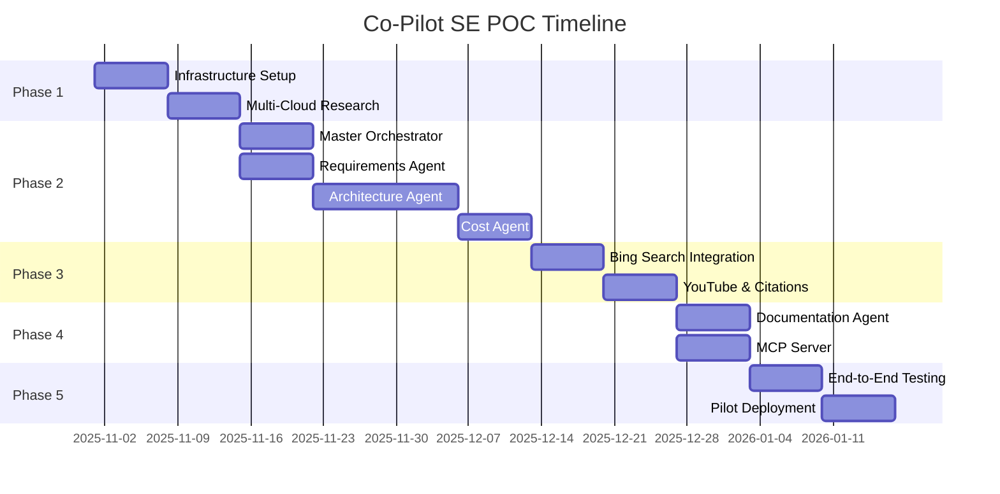

# Implementation Roadmap - Multi-Cloud POC

**Project:** Co-Pilot for Solution Engineers  
**Version:** 2.0 (Multi-Cloud POC)  
**Date:** October 31, 2025

---

## Table of Contents

1. [POC Overview](#poc-overview)
2. [Phase 1: Foundation & Multi-Cloud Research](#phase-1-foundation--multi-cloud-research)
3. [Phase 2: Core Agents Development](#phase-2-core-agents-development)
4. [Phase 3: Data Sources Integration](#phase-3-data-sources-integration)
5. [Phase 4: Documentation & MCP](#phase-4-documentation--mcp)
6. [Phase 5: Testing & Pilot](#phase-5-testing--pilot)
7. [Post-POC Roadmap](#post-poc-roadmap)

---

## POC Overview

### Timeline: 8-10 Weeks

### Scope
- **Users:** 10 cloud architects (pilot group)
- **Cloud Platforms:** AWS, GCP, Azure, Oracle Cloud
- **Architecture Approach:** Unified agent (one cloud at a time)
- **Data Strategy:** Online-only (no RAG, no document upload)
- **Interfaces:** Web portal (primary), MCP (secondary)

### Success Criteria
✅ Generate architectures for all 4 cloud platforms  
✅ Cost estimates within ±30% accuracy  
✅ 70% positive feedback from 10 pilot users  
✅ Average time from requirements to HLD < 10 minutes  
✅ MCP integration working with GitHub Copilot Chat

---

### Team Composition

| Role | Count | Responsibilities |
|------|-------|------------------|
| **Tech Lead / Architect** | 1 | Overall architecture, multi-cloud strategy |
| **Backend Engineers** | 2 | Azure Functions, API development, orchestration |
| **AI/ML Engineers** | 2 | Agent development, prompts, LLM integration |
| **Frontend Engineer** | 1 | Web portal, Teams bot (future) |
| **DevOps Engineer** | 1 | Azure infrastructure, CI/CD |
| **Product Manager** | 1 | Requirements, user research, pilot management |

**Total Team Size:** 8 people

---

## Development Phases

### Phase Summary

| Phase | Duration | Key Deliverables | Complexity |
|-------|----------|------------------|------------|
| **Phase 1: Foundation & Research** | 2 weeks | Infrastructure, multi-cloud research | Medium |
| **Phase 2: Core Agents** | 3 weeks | Master Orchestrator + 4 agents working | High |
| **Phase 3: Data Sources** | 2 weeks | Bing Search + trusted sources integrated | Medium |
| **Phase 4: Documentation & MCP** | 2 weeks | HLD generation + MCP server | Medium |
| **Phase 5: Testing & Pilot** | 1-2 weeks | End-to-end testing, pilot deployment | Low-Medium |

**Total: 10-11 weeks** (allows 1 week buffer)

---

## Phase 1: Foundation & Multi-Cloud Research

### Timeline: Week 1-2

### Objectives
✅ Simplified Azure infrastructure provisioned  
✅ Multi-cloud service mapping research complete  
✅ Trusted community sources validated  
✅ Development environment ready

---

### Week 1: Infrastructure Setup

#### Day 1-2: Core Azure Resources (Sweden Central)

```yaml
infrastructure:
  resource_group: "rg-copilot-se-poc"
  location: "swedencentral"
  
  resources:
    # Azure OpenAI for GPT-5
    - type: "Azure OpenAI"
      sku: "S0"
      model: "gpt-5"
      estimated_cost: "$500/month"
    
    # Azure Functions (Consumption Plan)
    - type: "Azure Functions"
      plan: "Consumption"
      runtime: "Python 3.11"
      estimated_cost: "$50/month"
    
    # Bing Search API
    - type: "Bing Search"
      tier: "S1"
      estimated_cost: "$9/month (3K queries)"
    
    # Azure API Management
    - type: "API Management"
      tier: "Consumption"
      estimated_cost: "$150/month"
    
    # Application Insights
    - type: "Application Insights"
      estimated_cost: "$50/month"
    
    # Key Vault
    - type: "Key Vault"
      sku: "Standard"
      estimated_cost: "$5/month"
    
  total_infrastructure_cost: "$764/month"
```

**Tasks:**
- [ ] Provision Azure OpenAI with GPT-5 deployment
- [ ] Create Azure Functions app (Python 3.11 runtime)
- [ ] Enable Bing Search API (S1 tier)
- [ ] Setup API Management (Consumption tier)
- [ ] Configure Application Insights for monitoring
- [ ] Create Key Vault for secrets management
- [ ] Setup Azure AD app registration for authentication
- [ ] Configure RBAC roles (Architect, Admin)

**Deliverable:** Infrastructure-as-Code (Bicep/Terraform) + deployed environment

---

#### Day 3-5: Development Environment

**Tasks:**
- [ ] Setup Git repository structure
  ```
  /src
    /agents         # Agent implementations
    /orchestrator   # Master orchestrator
    /api            # Azure Functions API
    /mcp-server     # MCP server code
    /web            # Web portal frontend
  /docs            # Documentation (current)
  /tests           # Unit & integration tests
  /infra           # IaC (Bicep/Terraform)
  ```
- [ ] Configure CI/CD pipeline (Azure DevOps or GitHub Actions)
- [ ] Setup local development environment
  - Python virtual environment
  - Node.js for MCP server
  - Azure Functions Core Tools
  - VS Code extensions (Python, Azure, Copilot)
- [ ] Create development, staging, production environments

**Deliverable:** Team can develop locally and deploy via CI/CD

---

### Week 2: Multi-Cloud Research

#### Research Objectives

1. **Service Mapping Across Clouds**
   - Map common services (compute, storage, database, networking)
   - Document service equivalencies and differences
   - Identify "no direct equivalent" scenarios

2. **Trusted Sources Validation**
   - Verify all curated sources are accessible and current
   - Test Bing Search queries for each cloud
   - Validate YouTube transcript extraction

3. **Pricing Sources Identification**
   - Test access to public pricing calculators
   - Document pricing page URLs for common services
   - Create baseline pricing guide (CSV/YAML)

#### Tasks

**Day 1-2: AWS Service Mapping**

- [ ] Map 20 most common services to Azure equivalents
  - Compute: EC2 ↔ Azure VM, Lambda ↔ Azure Functions, etc.
  - Storage: S3 ↔ Blob Storage, EBS ↔ Managed Disks
  - Database: RDS ↔ Azure SQL, DynamoDB ↔ Cosmos DB
  - Networking: VPC ↔ VNet, ALB ↔ Application Gateway
- [ ] Test Bing Search queries for AWS documentation
- [ ] Validate community sources (cloudonaut, Last Week in AWS)
- [ ] Extract pricing for 10 common AWS services

**Day 3-4: GCP & Oracle Service Mapping**

- [ ] Map 20 most common GCP services to Azure equivalents
  - Compute, Storage, Database, Networking
- [ ] Map 15 most common Oracle Cloud services
- [ ] Test Bing Search for GCP and OCI documentation
- [ ] Validate community sources for both platforms
- [ ] Extract pricing samples

**Day 5: Documentation & Validation**

- [ ] Create service mapping reference (Markdown table)
  ```markdown
  | Category | AWS | Azure | GCP | Oracle |
  |----------|-----|-------|-----|--------|
  | Compute (VM) | EC2 | Virtual Machines | Compute Engine | Compute |
  | Compute (Serverless) | Lambda | Functions | Cloud Functions | Functions |
  ...
  ```
- [ ] Document search query templates per cloud
- [ ] Validate 50 Bing Search queries across all clouds
- [ ] Create pricing baseline guide (YAML)

**Deliverable:** 
- `multi-cloud-service-mapping.md`
- `bing-search-query-templates.yaml`
- `pricing-baseline-guide.yaml`

---

## Phase 2: Core Agents Development

### Timeline: Week 3-5 (3 weeks)

### Objectives
✅ Master Orchestrator coordinating workflow  
✅ Requirements Agent extracting cloud + requirements  
✅ Multi-Cloud Architecture Agent designing for all 4 clouds  
✅ Cost Agent estimating from public sources  
✅ End-to-end agent workflow functional

---

### Week 3: Master Orchestrator + Requirements Agent

#### Master Orchestrator Implementation

**Tasks:**
- [ ] Implement agent coordination logic
  ```python
  class MasterOrchestrator:
      def orchestrate(self, user_request, context):
          # Stage 1: Requirements
          requirements = self.requirements_agent.extract(user_request)
          
          # Stage 2: Architecture
          architecture = self.architecture_agent.design(requirements)
          
          # Stage 3: Cost
          costs = self.cost_agent.estimate(architecture, requirements.cloud)
          
          # Stage 4: Documentation (optional)
          if context.get("generate_docs"):
              docs = self.documentation_agent.generate(architecture, costs)
          
          return {
              "requirements": requirements,
              "architecture": architecture,
              "costs": costs,
              "documentation": docs
          }
  ```
- [ ] Implement state management (in-memory for POC)
- [ ] Add retry logic for agent failures
- [ ] Implement citation aggregation
- [ ] Add workflow metadata tracking (timing, stages completed)

**Deliverable:** Orchestrator can coordinate 4-agent workflow

---

#### Requirements Agent Implementation

**Tasks:**
- [ ] Implement system prompt for requirements extraction
- [ ] Add cloud platform detection logic
  ```python
  def detect_cloud_platform(text):
      # Explicit mentions
      if "AWS" in text or "Amazon" in text:
          return "aws"
      elif "Azure" in text or "Microsoft" in text:
          return "azure"
      # Service name inference
      elif "EC2" in text or "Lambda" in text:
          return "aws"
      elif "App Service" in text:
          return "azure"
      # Ask user if unclear
      else:
          return None  # needs clarification
  ```
- [ ] Implement requirement structuring (functional, non-functional, constraints)
- [ ] Add clarifying question generation
- [ ] Test with 20 sample inputs across all clouds

**Test Cases:**
```python
test_cases = [
    {
        "input": "Build an AWS e-commerce platform for 10K users",
        "expected_cloud": "aws",
        "expected_vertical": "retail",
        "should_need_clarification": False
    },
    {
        "input": "Need a scalable web app",
        "expected_cloud": None,
        "should_need_clarification": True
    }
]
```

**Deliverable:** Requirements Agent working for all 4 clouds

---

### Week 4-5: Architecture Agent + Cost Agent

#### Architecture Agent Implementation

**Tasks:**
- [ ] Implement unified architecture agent system prompt
  ```python
  system_prompt = """
  You are a Multi-Cloud Architecture Agent.
  You design architectures for AWS, GCP, Azure, and Oracle Cloud.
  
  For each cloud, use:
  - AWS: Well-Architected Framework
  - Azure: Well-Architected Framework + CAF
  - GCP: Architecture Framework
  - Oracle: Architecture Center patterns
  
  Always cite official documentation and trusted community sources.
  """
  ```
- [ ] Implement Bing Search integration for architecture research
  ```python
  async def research_architecture(self, cloud, use_case, topic):
      queries = [
          f"{cloud} {use_case} reference architecture site:official_docs",
          f"{cloud} {topic} best practices",
          f"{cloud} Well-Architected {pillar}"
      ]
      
      results = []
      for query in queries:
          search_results = await bing_search(query, count=5)
          results.extend(search_results)
      
      return filter_and_rank(results)
  ```
- [ ] Implement service selection logic using service mapping
- [ ] Add Well-Architected validation per cloud
- [ ] Implement justification generation
- [ ] Test with 10 use cases per cloud (40 total)

**Test Use Cases per Cloud:**
- Web application (3-tier)
- API backend (serverless)
- Data analytics pipeline
- IoT platform
- E-commerce platform
- Content delivery
- Machine learning workload
- Database migration
- Batch processing
- Real-time streaming

**Deliverable:** Architecture Agent generates designs for all 4 clouds with citations

---

#### Cost Agent Implementation

**Tasks:**
- [ ] Implement Bing Search for pricing information
  ```python
  async def search_pricing(self, cloud, service, region):
      query = f"{cloud} {service} pricing {region} 2025"
      if cloud == "aws":
          query += " site:aws.amazon.com/pricing"
      # ... other clouds
      
      results = await bing_search(query, count=3)
      return extract_pricing_data(results)
  ```
- [ ] Implement pricing extraction from search snippets
- [ ] Add calculation logic for common services
- [ ] Implement low/medium/high scenarios
- [ ] Add assumptions and disclaimer generation
- [ ] Test with 20 pricing scenarios

**Test Cases:**
```python
cost_test_cases = [
    {
        "cloud": "aws",
        "service": "EC2",
        "instance_type": "t3.medium",
        "region": "us-east-1",
        "hours_per_month": 730,
        "expected_range": (30, 40)  # USD
    },
    # ... more test cases
]
```

**Deliverable:** Cost Agent estimates costs from public sources

---

## Phase 3: Data Sources Integration

### Timeline: Week 6-7 (2 weeks)

### Objectives
✅ Bing Search fully integrated  
✅ Trusted community sources accessible  
✅ YouTube transcript extraction working  
✅ Citation management implemented

---

### Week 6: Bing Search & Community Sources

#### Bing Search Integration

**Tasks:**
- [ ] Implement BingSearchClient class
  ```python
  class BingSearchClient:
      def __init__(self, api_key, endpoint):
          self.api_key = api_key
          self.endpoint = endpoint
          self.cache = {}  # In-memory cache
          self.rate_limiter = RateLimiter(qps=10)
      
      async def search(self, query, count=10, freshness="Month"):
          # Check cache
          if query in self.cache:
              return self.cache[query]
          
          # Rate limit
          await self.rate_limiter.acquire()
          
          # Execute search
          results = await self._execute_search(query, count, freshness)
          
          # Cache results
          self.cache[query] = results
          
          return results
  ```
- [ ] Add search result processing
  - URL classification (official vs community)
  - Source credibility scoring
  - Relevance ranking
- [ ] Implement search query templates per cloud
- [ ] Add retry logic and error handling
- [ ] Test with 100 queries across all clouds

**Metrics to Track:**
- Query latency (target: <2 seconds)
- Cache hit rate (target: >40%)
- Official source percentage (target: >60%)

---

#### Community Sources Validation

**Tasks:**
- [ ] Validate all curated community sources
  - Test accessibility (not behind paywalls)
  - Verify content quality
  - Check publication frequency
- [ ] Implement trusted source filtering
  ```python
  def is_trusted_source(url, cloud):
      trusted_domains = TRUSTED_SOURCES[cloud]
      return any(domain in url for domain in trusted_domains)
  ```
- [ ] Create fallback strategies if source unavailable
- [ ] Document access patterns for each source

**Deliverable:** All community sources validated and accessible

---

### Week 7: YouTube Transcripts & Citations

#### YouTube Transcript Extraction

**Tasks:**
- [ ] Integrate YouTube Data API
- [ ] Implement transcript extraction
  ```python
  from youtube_transcript_api import YouTubeTranscriptApi
  
  async def extract_transcript(video_id):
      try:
          transcript = YouTubeTranscriptApi.get_transcript(video_id)
          full_text = " ".join([item["text"] for item in transcript])
          return {
              "video_id": video_id,
              "transcript": full_text,
              "sections": extract_key_sections(transcript)
          }
      except Exception as e:
          return {"error": str(e), "transcript_available": False}
  ```
- [ ] Implement video search for trusted channels
- [ ] Add timestamp-based section extraction
- [ ] Test with 20 videos (5 per cloud)

**Test Videos:**
- John Savill's Azure networking video
- AWS re:Invent architecture session
- Google Cloud Next session
- Oracle Cloud webinar

---

#### Citation Management

**Tasks:**
- [ ] Implement CitationManager class
  ```python
  class CitationManager:
      def __init__(self):
          self.citations = []
      
      def add_from_search_result(self, result, cloud):
          citation = Citation(
              source_url=result["url"],
              title=result["title"],
              excerpt=result["snippet"],
              source_type=classify_source(result["url"]),
              cloud_provider=cloud,
              is_official=is_official_source(result["url"]),
              accessed_date=datetime.now()
          )
          self.citations.append(citation)
          return citation.citation_id
      
      def get_all_citations(self):
          return sorted(self.citations, 
                       key=lambda c: (c.is_official, c.relevance_score),
                       reverse=True)
  ```
- [ ] Implement citation formatting for HLD
- [ ] Add citation deduplication
- [ ] Test citation collection across workflow

**Deliverable:** Citations automatically collected and formatted

---

## Phase 4: Documentation & MCP

### Timeline: Week 8-9 (2 weeks)

### Objectives
✅ Documentation Agent generates HLDs + diagrams  
✅ MCP server functional  
✅ GitHub Copilot Chat integration working

---

### Week 8: Documentation Agent

#### HLD Generation

**Tasks:**
- [ ] Implement Documentation Agent system prompt
- [ ] Create HLD template structure
  ```markdown
  # High-Level Design: {Project Name}
  
  ## Executive Summary
  ## Requirements Overview
  ## Architecture Design
  ### Component 1
  ### Component 2
  ## Well-Architected Alignment
  ## Cost Breakdown
  ## Implementation Considerations
  ## References
  ```
- [ ] Implement Markdown generation
- [ ] Add cost summary table generation
- [ ] Test with 10 architectures

---

#### Diagram Generation

**Tasks:**
- [ ] Research diagram generation approaches
  - Option A: Generate Draw.io XML programmatically
  - Option B: Generate Mermaid diagrams (convert to Draw.io)
  - Option C: Use third-party diagram API
- [ ] Implement chosen approach
- [ ] Add cloud-specific icon sets
  - AWS Architecture Icons 2024
  - Azure Icons 2024
  - GCP Icons 2024
  - OCI Icons 2024
- [ ] Generate sample diagrams for each cloud
- [ ] Implement export to PNG/PPT

**Deliverable:** Documentation Agent generates professional HLDs

---

### Week 9: MCP Server

#### MCP Server Implementation

**Tasks:**
- [ ] Setup Node.js MCP server project
- [ ] Implement 3 MCP tools:
  1. `design_cloud_architecture`
  2. `estimate_cloud_costs`
  3. `generate_architecture_documentation`
- [ ] Implement authentication (Azure AD OAuth)
- [ ] Add request/response formatting
- [ ] Implement error handling
- [ ] Package for deployment

---

#### GitHub Copilot Chat Integration

**Tasks:**
- [ ] Test MCP server with GitHub Copilot Chat
- [ ] Create user onboarding documentation
- [ ] Test authentication flow
- [ ] Validate all 3 tools work end-to-end
- [ ] Create demo video

**Test Scenarios:**
```
# In GitHub Copilot Chat:
@copilot-se design an AWS Lambda-based image processing API

@copilot-se estimate costs for Azure App Service with 3 instances

@copilot-se generate documentation for the GCP architecture we designed
```

**Deliverable:** MCP integration functional with GitHub Copilot Chat

---

## Phase 5: Testing & Pilot

### Timeline: Week 10-11 (1-2 weeks)

### Objectives
✅ End-to-end testing complete  
✅ Performance validated  
✅ 10 pilot users onboarded  
✅ Feedback collected

---

### Week 10: End-to-End Testing

#### Integration Testing

**Test Scenarios:**
1. **AWS E-Commerce Architecture**
   - Input: E-commerce requirements
   - Expected: 3-tier architecture with cost estimate
   - Validation: Architecture complete, costs reasonable, citations present

2. **Azure Healthcare App**
   - Input: HIPAA-compliant healthcare app
   - Expected: Architecture with security emphasis
   - Validation: Security features highlighted, compliance mentioned

3. **GCP Data Analytics Pipeline**
   - Input: Real-time analytics requirements
   - Expected: BigQuery + Dataflow architecture
   - Validation: Services appropriate, cost breakdown

4. **Oracle Enterprise Database**
   - Input: High-performance database requirements
   - Expected: Autonomous Database architecture
   - Validation: OCI services correct, HA/DR addressed

**Tasks:**
- [ ] Execute 40 end-to-end tests (10 per cloud)
- [ ] Validate architecture quality
- [ ] Validate cost estimate accuracy (±30%)
- [ ] Validate citation completeness
- [ ] Measure performance metrics

**Performance Targets:**
| Metric | Target | Actual |
|--------|--------|--------|
| Total workflow time | <10 min | ___ |
| Requirements extraction | <30 sec | ___ |
| Architecture generation | <3 min | ___ |
| Cost estimation | <2 min | ___ |
| Documentation generation | <2 min | ___ |
| Search latency | <2 sec | ___ |
| Cache hit rate | >40% | ___ |

---

### Week 11: Pilot Deployment

#### Pilot User Onboarding

**Tasks:**
- [ ] Select 10 pilot users
  - 3 users: AWS experience
  - 3 users: Azure experience
  - 2 users: GCP experience
  - 2 users: Multi-cloud experience
- [ ] Create onboarding materials
  - Quick start guide
  - Video walkthrough
  - FAQ document
- [ ] Schedule 1:1 onboarding sessions
- [ ] Provide access to web portal
- [ ] Setup MCP for users with GitHub Copilot

---

#### Feedback Collection

**Feedback Mechanisms:**
1. **In-App Surveys** (after each architecture generation)
   - Overall satisfaction (1-5 stars)
   - Architecture quality (1-5)
   - Cost estimate usefulness (1-5)
   - Would you use this for real projects? (Yes/No)

2. **Weekly Check-ins** (30 min each)
   - What's working well?
   - What's frustrating?
   - Feature requests

3. **End-of-Pilot Survey**
   - Net Promoter Score (NPS)
   - Detailed feedback on each feature
   - Comparison to current workflow

**Success Criteria:**
- ✅ ≥70% positive feedback
- ✅ ≥4.0/5 average satisfaction
- ✅ ≥7 users would use for real projects

**Deliverable:** Pilot feedback report + recommendations

---

## Post-POC Roadmap

### After POC Success (Months 3-6)

#### Phase 6: Scale & Enhance (8 weeks)

**Objectives:**
- Scale to 50-100 users
- Add document upload capability
- Implement RAG for proprietary content
- Add Teams bot interface
- Improve UI/UX

**Key Features:**
1. **Document Upload & RAG**
   - Vector store (Azure AI Search)
   - Ingestion pipeline for PDFs, DOCX
   - Chunk and embed uploaded documents
   - Hybrid search (uploaded + online sources)

2. **Teams Bot**
   - Conversational interface in Microsoft Teams
   - Multi-turn conversations
   - Context retention across messages

3. **Enhanced UI**
   - Architecture visualization
   - Cost comparison scenarios
   - Export to multiple formats
   - Collaboration features (share, comment)

---

#### Phase 7: Enterprise Features (8 weeks)

**Objectives:**
- Compliance validation (optional)
- Hybrid/multi-cloud architectures
- Advanced cost optimization
- API for CI/CD integration

**Key Features:**
1. **Compliance Validation**
   - Re-introduce Compliance Agent
   - Check against HIPAA, FedRAMP, etc.
   - Generate compliance reports

2. **Hybrid/Multi-Cloud**
   - Design architectures spanning multiple clouds
   - Migration scenarios (e.g., AWS to Azure)
   - Cost comparison across clouds

3. **Advanced Cost Optimization**
   - Reserved instance recommendations
   - Spot/Preemptible instance suggestions
   - Right-sizing recommendations

4. **API & Automation**
   - REST API for programmatic access
   - Terraform/Bicep generation
   - CI/CD pipeline integration

---

## Dependencies & Critical Path

### Critical Path



### Key Dependencies

| Task | Depends On | Blocker If Delayed |
|------|------------|-------------------|
| Agent Development | Azure OpenAI provisioned | YES - Cannot develop without LLM access |
| Architecture Agent | Multi-cloud research complete | YES - Needs service mappings |
| Cost Agent | Pricing sources identified | MEDIUM - Can use estimates |
| MCP Server | All agents working | YES - Needs backend API functional |
| Pilot | All features complete | YES - Need working system |

---

### Risk Mitigation

| Risk | Probability | Impact | Mitigation |
|------|------------|--------|------------|
| **Azure OpenAI quota** | Medium | High | Request quota increase early, have fallback to OpenAI API |
| **Bing Search rate limits** | Low | Medium | Implement caching, monitor usage |
| **Multi-cloud research incomplete** | Medium | High | Prioritize top 20 services per cloud, document gaps |
| **Agent prompt engineering** | High | Medium | Allocate time for iteration, test with real scenarios |
| **MCP integration complexity** | Medium | Low | MCP is secondary interface, not critical for POC |
| **Pilot user availability** | Medium | Medium | Recruit 12 users (2 backup), flexible schedule |

---

**Last Updated:** October 31, 2025  
**Document Owner:** Engineering Team  
**Version:** 2.0 (Multi-Cloud POC)
